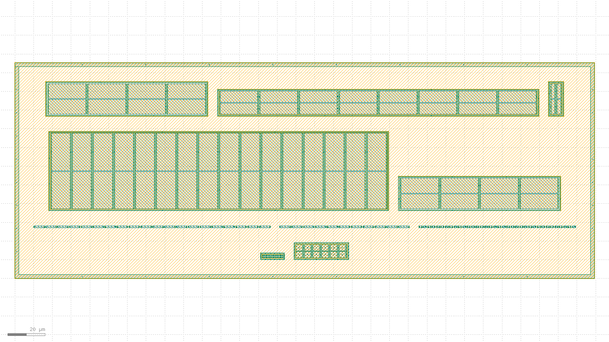

# Bandgap-core floorplan skeleton DRC record: 20260803-192947-e7a30b4

Initial placed layout skeleton for issue #15 (floorplan + matching plan). See `layout/matching-plan.md` for the full matching-effort rationale this floorplan implements -- this record is the DRC evidence for the skeleton that document describes, not a substitute for it.

## Overall verdict: PASS

- [x] DRC on the composed floorplan is clean
- [x] Composed bbox area (35,763 um^2) is within the < 0.05 mm^2 (50,000 um^2) budget

## Flow

1. `klt gen` once per matched device group (10 blocks -- see `compose.inner.request.json` and each `<id>.gen.json`).
2. `klt gen-compose` with `placement.strategy: "explicit"` (2AMLogic/klayout-tools#330) places all 10 on a computed, horizontally-centered four-row grid (PNP arrays / resistor ladders / amp input+load pair / amp mirror pairs) -- `compose.inner.request.json`.
3. `klt gen guard_ring`, sized and centered from the composed content's own reported bbox, wraps the whole floorplan.
4. A second `klt gen-compose` places all 10 blocks plus the ring -- `compose.request.json` -> `bandgap_core_floorplan.gds`.
5. `klt drc bandgap_core_floorplan.gds --deck sky130`.
6. `klt render bandgap_core_floorplan.gds` -- per-layer + combined overview PNGs, for the visual common-centroid/dummy-ring check below (not itself DRC/LVS evidence).

## Visual verification

Read left-to-right, bottom-to-top by `origin_um` (see `compose.request.json`): row 0 (lowest y) is the PNP CTAT/PTAT pair, row 1 the resistor ladders, row 2 the amp input pair + NMOS loads, row 3 (highest y) the amp mirror pairs + core mirror, all enclosed by the outer guard ring. Each matched group's own inner ring and interdigitated/cross-quad striping (from `bjt_array`'s `topology=common_centroid` and `diff_pair`'s cross-quad `splits`) is visible at this render scale; per-layer PNGs are under `renders/` for a closer look at any one layer.

## Blocks

| id | generator | matched group | real target |
| --- | --- | --- | --- |
| `pnp_ctat` | `bjt_array` | Q1 (CTAT PNP, small unit W0p68L0p68) | m=8 sky130_fd_pr__pnp_05v5_W0p68L0p68 (design/bandgap_core.sch); drawn 1:1 with the schematic count (8 real units, 2x4 common-centroid) |
| `pnp_ptat` | `bjt_array` | Q2 (PTAT PNP, large unit W3p40L3p40) | m=8 sky130_fd_pr__pnp_05v5_W3p40L3p40 (design/bandgap_core.sch); drawn 1:1 with the schematic count (8 real units, 2x4 common-centroid) |
| `res_r2` | `res_array` | R2A/R2B interdigitated ladder (K = R2/R1 divider) | n_r2=54 unit segments PER LEG x 2 legs = 108 total (design/bandgap_core.sch); skeleton uses 16 (8 per leg, alternating A/B by index) -- 108 does not fit a single-row res_array within the < 0.05 mm^2 budget without folding, a real klt gap (2AMLogic/klayout-tools#415); see layout/matching-plan.md |
| `res_r1` | `res_array` | R1 (dVBE-to-current leg) | n_r1=7 unit segments (design/bandgap_core.sch); drawn 1:1 |
| `res_trim` | `res_array` | Downward-only trim ladder taps (both legs) | n_r2_trim range 0..-16 codes x 2 legs (R2A, R2B) = 32 1um unit taps (design/bandgap_core.sch CORE_PARAMS, DR-002); drawn 1:1 |
| `amp_input_pair` | `diff_pair` | MP1/MP2 (amp PMOS input pair) | amp_m_in=16, W=20 L=10 (design/error_amp.sch); drawn 1:1; the dominant contributor per sim/monte-carlo-untrimmed and design/error-amp-offset-budget.md -- see layout/matching-plan.md |
| `amp_nload` | `diff_pair` | MN1/MN2 (amp NMOS diode loads) | amp_m_nmirr=4, W=8 L=20 (design/error_amp.sch); drawn 1:1. MN1..MN4 are one 4-device matched group in the offset budget; gen-compose's diff_pair generator only matches 2 devices at a time, so this is split into two matched pairs (MN1/MN2 here, MN3/MN4 in amp_nmirr below) -- see layout/matching-plan.md |
| `amp_nmirr` | `diff_pair` | MN3/MN4 (amp NMOS mirror outputs) | amp_m_nmirr=4, W=8 L=20 (design/error_amp.sch); drawn 1:1 |
| `amp_pmirr` | `diff_pair` | MP3/MP4 (amp PMOS mirror) | amp_m_pmirr=8, W=6 L=20 (design/error_amp.sch); drawn 1:1 |
| `core_mirror` | `diff_pair` | MPOUT/MPAMP (core PMOS output/bias mirror) | m_out=m_ampbias=2, W=8 L=2 (design/bandgap_core.sch); drawn 1:1 |

Note: MCC (amp compensation cap, amp_m_cc=16 x W=30 x L=20 = 9600 um^2) is single-ended and not drawn in this skeleton; see layout/matching-plan.md

## Composed floorplan

- Composed bbox (um): `{'x0': -10.15, 'y0': -10.15, 'x1': 299.43, 'y1': 105.37}`
- Composed bbox area: 35,763 um^2 (budget: 50,000 um^2)
- Outer guard ring: inner 305.28 x 111.22 um, ring width 2.0 um, 8 contacts/side

## Results

| Stage | Status | Detail |
| --- | --- | --- |
| DRC | clean | violation_count=0 |

## What this record does NOT claim

- **No LVS.** `klt extract`/`klt lvs` are not run on the composed output -- `bjt_array` and `res_array` output are both known not to round-trip through `klt extract` as recognized `pnp`/`resistor` devices today (2AMLogic/klayout-tools#176, #369), so an LVS claim here would not be meaningful evidence. DRC-clean is this issue's acceptance bar; LVS-clean bandgap-core layout is later work.
- **Not to scale on the resistor ladder.** `res_r2` uses a reduced representative segment count (16, not the real 108) -- see the Blocks table above and `layout/matching-plan.md`; 2AMLogic/klayout-tools#415 tracks the folding gap that blocks a full-scale single-row layout from fitting the area budget.
- **Row placement within the amp/resistor groups is illustrative, not final.** The four-row grid establishes the relative floorplan (PNP arrays / resistor ladders / amp input+load pair / amp mirror pairs) and proves the composition + DRC-clean mechanism; exact spacing, routing, and the amp-quad simplification (MN1..MN4 split into two matched pairs -- see the Blocks table) are documented open items in `layout/matching-plan.md`, not finished tape-out geometry.

## Provenance

- Record ID: `20260803-192947-e7a30b4`
- `klt` version: `klt 0.1.0` (pinned commit, see `layout/requirements.txt`)
- KLayout engine version: `0.30.10`
- Repo state: `e7a30b4dd116cd053fa5d76ec15fd54ead771b8a` on `feature/issue-15` (dirty)

## Links

- [`compose.inner.request.json`](compose.inner.request.json), [`compose.inner.json`](compose.inner.json)
- [`compose.request.json`](compose.request.json), [`compose.json`](compose.json)
- [`drc.json`](drc.json)
- [`render.json`](render.json), [`renders/overview.png`](renders/overview.png)
- [`bandgap_core_floorplan.gds`](bandgap_core_floorplan.gds)
