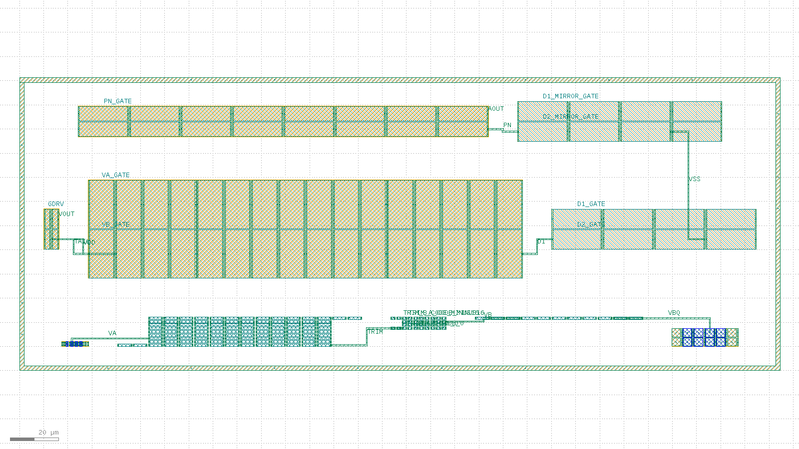

# Bandgap-core routed layout record: 20260804-001742-bc9c31f

Routed-and-extracted successor to the issue #15 placement-only floorplan skeleton (`layout/bandgap-core/reports/` earlier records). Read `layout/matching-plan.md` for the matching rationale this layout implements; this record is the measured evidence, not the rationale.

## Acceptance-criteria scoreboard (issue #62)

| # | Criterion | Status | Evidence |
| --- | --- | --- | --- |
| 1 | Full inter-block routing | PARTIAL | 4/12 **schematic** inter-block nets fully drawn (9/9 declared 2-pin hops routed, 0 unrouted) -- see "Schematic inter-block nets" below |
| 2 | Resistor ladder at real unit count | MET | `res_r2` num=108 (= 2 x n_r2=54); composed bbox 38,171 um^2 vs 50,000 um^2 budget |
| 3 | Extract: correct device classes + promoted pins | MET | device_counts={"nfet": 16, "pfet": 52, "pnp": 16, "res_generic_po": 159}, pin_count=23 |
| 4 | `klt lvs` clean | NOT MET | status=mismatch, mismatch_count=790 |
| 5 | Blocking `klt` gaps filed as friction | MET | 2AMLogic/klayout-tools#432 (PNP recognition marker), #433 (single routing metal), #434 (no route into a guard-ringed block) |

- [x] DRC on the composed, routed layout is clean
- [x] Composed bbox area (38,171 um^2) is within the < 0.05 mm^2 (50,000 um^2) budget, **at the real 108-unit ladder count**

## Flow

1. `klt gen` once per matched device group (10 blocks).
2. `klt draw` once per PNP array: a device-recognition overlay (82/44 marker per functional emitter pad, 65/44 nwell tap per base pad), positioned from that block's own reported `ports[]`.
3. `klt gen-compose` with `placement.strategy: "explicit"`, `connectivity[]` (routed 2-pin nets) and `pins[]` (labelled single-port nets) -- `compose.request.json`.
4. `klt drc <composed> --deck sky130`.
5. `klt extract <composed> --deck sky130 --top bandgap_core_routed`.
6. `klt lvs` against the xschem-derived reference netlist (issue #8).
7. `klt render` for the visual check below.

## Blocks

| id | generator | matched group | real target |
| --- | --- | --- | --- |
| `pnp_ctat` | `bjt_array` | Q1 (CTAT PNP, small unit W0p68L0p68) | m=8 sky130_fd_pr__pnp_05v5_W0p68L0p68 (design/bandgap_core.sch); drawn 1:1 (8 real units, 2x4 common-centroid) |
| `res_r2` | `res_array` | R2A/R2B interdigitated ladder (K = R2/R1 divider) | n_r2=54 unit segments PER LEG x 2 legs = 108 total (design/bandgap_core.sch); drawn 1:1 -- the skeleton's 16-unit reduction is closed here by `res_array`'s `rows` fold parameter (2AMLogic/klayout-tools#415, merged via #418) |
| `res_trim` | `res_array` | Downward-only trim ladder taps (both legs) | n_r2_trim range 0..-16 codes x 2 legs = 32 1um unit taps (design/bandgap_core.sch CORE_PARAMS, DR-002); drawn 1:1 |
| `res_r1` | `res_array` | R1 (dVBE-to-current leg) | n_r1=7 unit segments (design/bandgap_core.sch); drawn 1:1 |
| `pnp_ptat` | `bjt_array` | Q2 (PTAT PNP, large unit W3p40L3p40) | m=8 sky130_fd_pr__pnp_05v5_W3p40L3p40 (design/bandgap_core.sch); drawn 1:1 (8 real units, 2x4 common-centroid) |
| `core_mirror` | `diff_pair` | MPOUT/MPAMP (core PMOS output/bias mirror) | m_out=m_ampbias=2, W=8 L=2 (design/bandgap_core.sch); drawn 1:1 |
| `amp_input_pair` | `diff_pair` | MP1/MP2 (amp PMOS input pair) | amp_m_in=16, W=20 L=10 (design/error_amp.sch); drawn 1:1 -- the dominant mismatch contributor per layout/matching-plan.md Section 1 |
| `amp_nload` | `diff_pair` | MN1/MN2 (amp NMOS diode loads) | amp_m_nmirr=4, W=8 L=20 (design/error_amp.sch); drawn 1:1 |
| `amp_pmirr` | `diff_pair` | MP3/MP4 (amp PMOS mirror) | amp_m_pmirr=8, W=6 L=20 (design/error_amp.sch); drawn 1:1 |
| `amp_nmirr` | `diff_pair` | MN3/MN4 (amp NMOS mirror outputs) | amp_m_nmirr=4, W=8 L=20 (design/error_amp.sch); drawn 1:1 |

Note: MCC (amp compensation cap, amp_m_cc=16 x W=30 x L=20 = 9600 um^2) is single-ended and not drawn here, exactly as in the #15 skeleton; see layout/matching-plan.md's area-budget section for why

## Routed nets

| net | pins | routed | length (um) |
| --- | --- | --- | --- |
| `VA` | pnp_ctat.Q3_E -> res_r2.R24_A | yes | 33.63 |
| `TRIM` | res_r2.R11_B -> res_trim.R0_A | yes | 36.78 |
| `VB` | res_trim.R23_B -> res_r1.R1_A | yes | 32.84 |
| `VBQ` | res_r1.R6_B -> pnp_ptat.Q1_E | yes | 46.65 |
| `TAIL` | core_mirror.M2_1_D -> amp_input_pair.Q1_1_S | yes | 18.72 |
| `D1` | amp_input_pair.Q2_8_D -> amp_nload.M1_1_S | yes | 18.57 |
| `PN` | amp_nmirr.M1_1_S -> amp_pmirr.M2_4_D | yes | 13.57 |
| `VDD` | core_mirror.M2_1_S -> amp_input_pair.Q2_1_S | yes | 32.38 |
| `VSS` | amp_nload.M1_2_D -> amp_nmirr.M1_2_D | yes | 58.70 |

## Schematic inter-block nets: drawn vs. labelled only

The table above counts this flow's own `connectivity[]` declaration. This one counts what issue #62 actually asks for: every node of design/bandgap_core.sch (+ design/error_amp.sch) that joins devices in different blocks, and whether drawn metal joins **all** the blocks the schematic says it reaches. `klt gen-compose` routes 2-pin nets only, so a trunk can only be built as a chain of same-labelled hops -- and a hop is only certifiable when the two blocks are adjacent across an empty channel (2AMLogic/klayout-tools#433, #434). Everything not drawn below exists in the layout as a promoted pin label, i.e. it is addressable but electrically open.

| schematic net | reaches (blocks) | joined by drawn metal | not drawn | status |
| --- | --- | --- | --- | --- |
| `VA` | `pnp_ctat`, `res_r2`, `amp_input_pair` | `pnp_ctat`, `res_r2` | `amp_input_pair` | **partial** |
| `VB` | `res_trim`, `res_r1`, `amp_input_pair` | `res_r1`, `res_trim` | `amp_input_pair` | **partial** |
| `TRIM` | `res_r2`, `res_trim` | `res_r2`, `res_trim` | -- | **drawn** |
| `VBQ` | `res_r1`, `pnp_ptat` | `pnp_ptat`, `res_r1` | -- | **drawn** |
| `VOUT` | `core_mirror`, `res_r2` | -- | `core_mirror`, `res_r2` | **labelled only** |
| `GDRV` | `core_mirror`, `amp_pmirr`, `amp_nmirr` | -- | `amp_nmirr`, `amp_pmirr`, `core_mirror` | **labelled only** |
| `TAIL` | `core_mirror`, `amp_input_pair` | `amp_input_pair`, `core_mirror` | -- | **drawn** |
| `D1` | `amp_input_pair`, `amp_nload`, `amp_nmirr` | `amp_input_pair`, `amp_nload` | `amp_nmirr` | **partial** |
| `D2` | `amp_input_pair`, `amp_nload`, `amp_nmirr` | -- | `amp_input_pair`, `amp_nload`, `amp_nmirr` | **labelled only** |
| `PN` | `amp_nmirr`, `amp_pmirr` | `amp_nmirr`, `amp_pmirr` | -- | **drawn** |
| `VDD` | `core_mirror`, `amp_input_pair`, `amp_pmirr` | `amp_input_pair`, `core_mirror` | `amp_pmirr` | **partial** |
| `VSS` | `amp_nload`, `amp_nmirr`, `pnp_ctat`, `pnp_ptat`, `res_r2`, `res_trim`, `res_r1` | `amp_nload`, `amp_nmirr` | `pnp_ctat`, `pnp_ptat`, `res_r1`, `res_r2`, `res_trim` | **partial** |

**4 of 12 schematic inter-block nets are fully drawn.** Criterion 1 is therefore scored PARTIAL, not MET, whenever that count is short: the `VDD` trunk reaches two of its three blocks, `VSS` two of seven (its seven include the three resistor blocks: `res_high_po` is a 3-terminal device whose bulk ties to `VSS` in the schematic, and this table states what the *schematic* requires even where the 2-terminal `res_generic_po` reference cards cannot carry it), and `VOUT` / `GDRV` (the amp output the schematic ties straight to the mirror gates) are labelled pins with no metal between them. The same single-routing-metal limit that blocks criterion 4 caps this criterion too.

## Promoted top-level pins

`klt gen-compose` labelled 14/14 requested `pins[]` ports; `klt extract` promoted **23** top-level pins (the #15 skeleton promoted `pin_count: 0`).

| net | port | labelled |
| --- | --- | --- |
| `GDRV` | core_mirror.M2_2_G | yes |
| `VOUT` | core_mirror.M1_2_D | yes |
| `VA_GATE` | amp_input_pair.Q2_9_G | yes |
| `VB_GATE` | amp_input_pair.Q1_1_G | yes |
| `D1_GATE` | amp_nload.M2_3_G | yes |
| `D2_GATE` | amp_nload.M1_1_G | yes |
| `D1_MIRROR_GATE` | amp_nmirr.M2_3_G | yes |
| `D2_MIRROR_GATE` | amp_nmirr.M1_1_G | yes |
| `PN_GATE` | amp_pmirr.M2_5_G | yes |
| `AOUT` | amp_pmirr.M1_8_D | yes |
| `TRIM_A_CODE_0` | res_trim.R0_B | yes |
| `TRIM_A_CODE_MINUS16` | res_trim.R30_B | yes |
| `TRIM_B_CODE_0` | res_trim.R1_B | yes |
| `TRIM_B_CODE_MINUS16` | res_trim.R31_B | yes |

## Results

| Stage | Status | Detail |
| --- | --- | --- |
| compose | routed | nets=9, unrouted=0 |
| DRC | clean | violation_count=0 |
| extract | ok | device_count=243, device_counts={"nfet": 16, "pfet": 52, "pnp": 16, "res_generic_po": 159}, pin_count=23 |
| LVS | mismatch | mismatch_count=790 |

### Extracted device classes vs. the #15 skeleton

| class | this record | #15 skeleton |
| --- | --- | --- |
| `pnp` | 16 | 0 |
| `nfet` | 16 | 0 |
| `pfet` | 52 | 68 |
| `res_generic_po` | 159 | 67 |
| promoted pins | 23 | 0 |

### LVS mismatch analysis

| | layout | reference | matched |
| --- | --- | --- | --- |
| nets | 519 | 11 | 0 |
| devices | 243 | 16 | 0 |
| pins | 23 | 4 | 27 |

Mismatch categories: `{"device.body_unverified": 1, "device.unmatched": 259, "net.unmatched": 530}`.

The gap has one dominant cause plus two smaller, separately disclosed deltas. The dominant cause: the reference netlist expresses each matched group the way the schematic does -- one device carrying a multiplicity (`m=8` PNPs, `m=16` input-pair PMOS) or one resistor carrying a total length (`R2A` = 54 unit segments' worth). The layout draws those as the physical instances they are, and cannot bus them into one node, because bussing an array's units requires a wire that crosses the block -- which today's router can only draw on the same single metal the device pads occupy, shorting every pad it crosses (2AMLogic/klayout-tools#433). The bulk of the unmatched devices and nets below trace back to that: the layout's device and net counts are the un-bussed expansion of the reference's, not a topology error in either. Closing the gap needs the upstream capability, not a different reference netlist -- rewriting the reference to enumerate the layout's own un-bussed devices would make LVS compare the layout against itself, which is not evidence.

The two smaller deltas, folded in here so this paragraph is not read as "one cause explains everything": (a) `MMCC`, the amp's compensation cap, is in the reference but deliberately not drawn in this layout (see the Blocks note above), so one reference device has no layout counterpart by construction; and (b) the schematic inter-block nets left as labelled-only pins in the table above (`VOUT`, `GDRV`/`AOUT`, `D2`, and the unjoined legs of `VDD`/`VSS`/`VA`/`VB`/`D1`) are single reference nodes that the layout carries as two or more open nodes. Neither is an error in the reference netlist, and neither is accommodated in it: `reference.spice` states the schematic (one `GDRV` node, no 0-ohm bridge device), and the gaps are recorded here.

## Visual verification

## What this record does NOT claim

- **Not LVS-clean.** `klt lvs` reports `mismatch` with `mismatch_count=790` against the xschem-derived reference netlist. The blocking reason is a tool gap, not a layout choice: sky130's generator/router layer-role table exposes exactly one routing metal role (`metal` -> li1 67/20) even though the same tool's sky130 extraction deck declares a second metal (68/20) and a via (67/44). Every `klt gen` generator draws its device pads on that same li1, and `klt gen-compose`'s router is documented as unaware of a block's internal geometry, so any route crossing a block shorts to every pad it passes over. Intra-block bussing (an array's emitters, a ladder's series segments) is therefore not expressible, which is what keeps this layout from LVS-closing against the schematic -- see 2AMLogic/klayout-tools#433.
- **Not fully inter-block routed either.** 4/12 schematic inter-block nets are joined across every block they reach; the rest are promoted pin labels with no metal between them (`VOUT` never reaches the ladder, `AOUT`/`GDRV` are two pins where the schematic has one node, `D2` is undrawn, and the `VDD`/`VSS` trunks each stop short of blocks they supply). `klt gen-compose` routes 2-pin nets between blocks adjacent across an empty channel only, so a trunk is a chain of hops and a non-adjacent pair is unroutable -- the same #433/#434 limits as above. Criterion 1 is scored PARTIAL on this basis, against the schematic's node list rather than this flow's own declaration.
- **No intra-block bussing is drawn.** Each PNP array's 8 emitters, each ladder's unit segments, and each matched pair's split fingers stay separate nodes in the extracted netlist for the reason above. This flow deliberately does not draw those wires rather than draw a known short and call it connectivity.
- **Per-matched-group guard rings are off.** `klt gen-compose`'s router rejects any route to a non-tap port on a block that reports a guard/collector ring, because the route would cross the ring's own metal loop -- and offers no way in. Per-matched-group guard rings and inter-block connectivity are therefore mutually exclusive today. This flow drops the per-group rings (keeping the cell-level ring) so connectivity can be drawn at all, a matching-quality regression relative to the #15 skeleton that is recorded in layout/matching-plan.md Section 5 -- see 2AMLogic/klayout-tools#434. The cell-level ring is still drawn and DRC-checked.
- **The PNP devices are recognition-marked drawn geometry, not vendor `pnp_05v5` cell instances.** `klt gen bjt_array` draws a matching-faithful floorplan from base layers by design (its own generator note says so); the overlay this flow adds makes that geometry *extract* as `pnp`, it does not make it a SPICE-model-exact device.

## Provenance

- Record ID: `20260804-001742-bc9c31f`
- `klt` version: `klt 0.1.0` (pinned, see `layout/requirements.txt`)
- KLayout engine version: `0.30.10`
- Repo state: `bc9c31fd10068554b368d8f4b55b3d7e675e9c71` on `feature/issue-62` (dirty)

## Links

- [`compose.request.json`](compose.request.json), [`compose.json`](compose.json)
- [`drc.json`](drc.json), [`extract.json`](extract.json), [`lvs.json`](lvs.json)
- [`bandgap_core_routed.extract.spice`](bandgap_core_routed.extract.spice), [`reference.spice`](reference.spice)
- [`bandgap_core_routed.gds`](bandgap_core_routed.gds)
- [`render.json`](render.json), [`renders/overview.png`](renders/overview.png)
