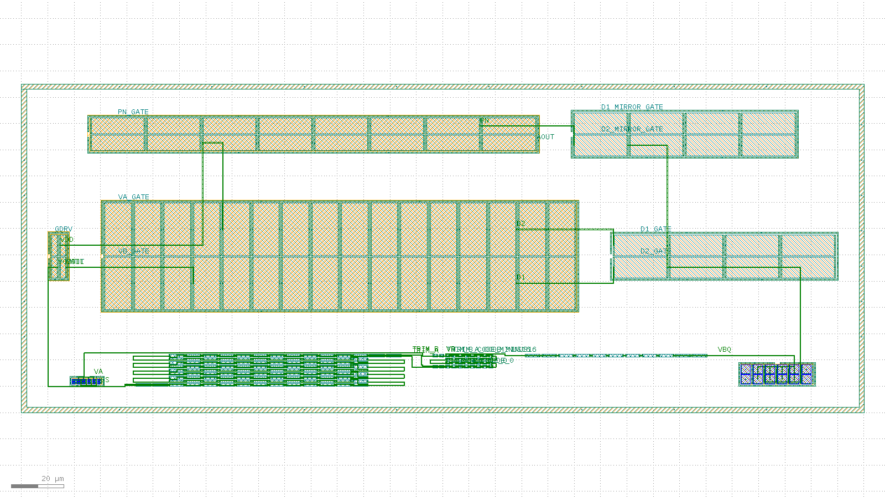

# Bandgap-core routed layout record: 20260804-012421-1a97bf5

Routed-and-extracted successor to the issue #15 placement-only floorplan skeleton (`layout/bandgap-core/reports/` earlier records). Read `layout/matching-plan.md` for the matching rationale this layout implements; this record is the measured evidence, not the rationale.

## Acceptance-criteria scoreboard (issue #62)

| # | Criterion | Status | Evidence |
| --- | --- | --- | --- |
| 1 | Full inter-block routing | PARTIAL | 6/12 **schematic** inter-block nets fully drawn (11/12 declared met1 nets routed, 1 unrouted) -- see "Schematic inter-block nets" below |
| 2 | Resistor ladder at real unit count | MET | `res_r2` num=108 (= 2 x n_r2=54); composed bbox 40,019 um^2 vs 50,000 um^2 budget |
| 3 | Extract: correct device classes + promoted pins | MET | device_counts={"nfet": 16, "pfet": 52, "pnp": 24, "res_generic_po": 159}, pin_count=24 |
| 4 | `klt lvs` clean | NOT MET | status=mismatch, mismatch_count=365 |
| 5 | Blocking `klt` gaps filed as friction | MET | #432/#433/#434 (prior increment's PNP marker / single-routing-metal / guard-ring blockers) all CLOSED upstream; this increment's own residual blockers are 2AMLogic/klayout-tools#461 (MOS gate poly has no contact landing area -- dominant), #462 (dummy-device marker is MOS-gate-only, not bipolar/resistor), #463 (sky130 `res_array` cannot draw non-default resistor flavours) |

- [x] DRC on the composed, routed layout is clean
- [x] Composed bbox area (40,019 um^2) is within the < 0.05 mm^2 (50,000 um^2) budget, **at the real 108-unit ladder count**

## Flow

1. `klt gen` once per matched device group (10 blocks).
2. `klt draw` once, for the whole cell: every intra-block bus and every inter-block net, on met1 over mcon, plus one met1 net label each -- `bandgap_core_bus.draw.json`, summarised in `bus-summary.json`.
3. `klt gen-compose` with `placement.strategy: "explicit"`, an empty `connectivity[]` (routing is on met1, above) and `pins[]` for the label-only nodes -- `compose.request.json`.
4. `klt drc <composed> --deck sky130`.
5. `klt extract <composed> --deck sky130 --top bandgap_core_routed`.
6. `klt lvs` against the xschem-derived reference netlist (issue #8), twice -- with and without `options.combine_devices`.
7. `klt render` for the visual check below.

## Blocks

| id | generator | matched group | real target |
| --- | --- | --- | --- |
| `pnp_ctat` | `bjt_array` | Q1 (CTAT PNP, small unit W0p68L0p68) | m=8 sky130_fd_pr__pnp_05v5_W0p68L0p68 (design/bandgap_core.sch); drawn 1:1 (8 real units, 2x4 common-centroid) |
| `res_r2` | `res_array` | R2A/R2B interdigitated ladder (K = R2/R1 divider) | n_r2=54 unit segments PER LEG x 2 legs = 108 total (design/bandgap_core.sch); drawn 1:1 -- the skeleton's 16-unit reduction is closed here by `res_array`'s `rows` fold parameter (2AMLogic/klayout-tools#415, merged via #418) |
| `res_trim` | `res_array` | Downward-only trim ladder taps (both legs) | n_r2_trim range 0..-16 codes x 2 legs = 32 1um unit taps (design/bandgap_core.sch CORE_PARAMS, DR-002); drawn 1:1 |
| `res_r1` | `res_array` | R1 (dVBE-to-current leg) | n_r1=7 unit segments (design/bandgap_core.sch); drawn 1:1 |
| `pnp_ptat` | `bjt_array` | Q2 (PTAT PNP, large unit W3p40L3p40) | m=8 sky130_fd_pr__pnp_05v5_W3p40L3p40 (design/bandgap_core.sch); drawn 1:1 (8 real units, 2x4 common-centroid) |
| `core_mirror` | `diff_pair` | MPOUT/MPAMP (core PMOS output/bias mirror) | m_out=m_ampbias=2, W=8 L=2 (design/bandgap_core.sch); drawn 1:1 |
| `amp_input_pair` | `diff_pair` | MP1/MP2 (amp PMOS input pair) | amp_m_in=16, W=20 L=10 (design/error_amp.sch); drawn 1:1 -- the dominant mismatch contributor per layout/matching-plan.md Section 1 |
| `amp_nload` | `diff_pair` | MN1/MN2 (amp NMOS diode loads) | amp_m_nmirr=4, W=8 L=20 (design/error_amp.sch); drawn 1:1 |
| `amp_pmirr` | `diff_pair` | MP3/MP4 (amp PMOS mirror) | amp_m_pmirr=8, W=6 L=20 (design/error_amp.sch); drawn 1:1 |
| `amp_nmirr` | `diff_pair` | MN3/MN4 (amp NMOS mirror outputs) | amp_m_nmirr=4, W=8 L=20 (design/error_amp.sch); drawn 1:1 |

Note: MCC (amp compensation cap, amp_m_cc=16 x W=30 x L=20 = 9600 um^2) is single-ended and not drawn here, exactly as in the #15 skeleton; see layout/matching-plan.md's area-budget section for why

## Intra-block busses drawn on met1

Each matched array's units are tied into the node the schematic says they form, on met1 over mcon -- the sky130 extraction deck's own second conductor and via (`metals = (li1, met1)`, `vias = (mcon,)`). The li1 router cannot express these at all (2AMLogic/klayout-tools#433 and its merged fix #439, which made the failure visible rather than expressible), so this flow draws them itself from each block's reported `ports[]`. This is what turns a 108-segment ladder into two real series resistors and an 8-unit PNP array into one real m=8 device.

| block | bus | detail |
| --- | --- | --- |
| `pnp_ctat` | parallel unit bus | `VA` = 8 pads on 4 columns; `VSS` = 8 pads on 4 columns |
| `res_r2` | 2 interdigitated series string(s) | 106 unit-to-unit met1 links |
| `res_trim` | 2 interdigitated series string(s) | 30 unit-to-unit met1 links |
| `res_r1` | 1 interdigitated series string(s) | 6 unit-to-unit met1 links |
| `pnp_ptat` | parallel unit bus | `VBQ` = 8 pads on 4 columns; `VSS` = 8 pads on 4 columns |

Drawn-short / spacing proof: every met1 rectangle carries the electrical node it belongs to, and **0** pairs of rectangles belonging to *different* nodes come within the deck's 0.14 um `met1.space.1` clearance. The flow fails on any nonzero count -- a drawn short the DRC deck happens not to model would otherwise read as connectivity.

## Inter-block nets drawn on met1

| net | terminals | routed | schematic node |
| --- | --- | --- | --- |
| `TAIL` | `core_mirror.M2_1_D` + `amp_input_pair.Q2_2_S` | yes | MPAMP drain to the amp input pair's common source |
| `D1` | `amp_input_pair.Q2_7_D` + `amp_nload.M1_1_S` | yes | amp input-pair drain to its NMOS diode load |
| `D2` | `amp_input_pair.Q1_15_D` + `amp_nload.M2_3_S` | yes | the amp input pair's other drain to its other NMOS diode load -- undrawable before this increment because `gen-compose` routes one 2-pin net per block-pair channel |
| `PN` | `amp_pmirr.M2_8_D` + `amp_nmirr.M1_1_S` | yes | amp NMOS mirror output to the PMOS mirror |
| `VA` | `pnp_ctat:VA trunk` + `res_trim.R30_B` | yes | the R2A leg's low end (through its trim taps) to Q1's emitter bus -- the amp's VINN node |
| `TRIM_A` | `res_r2.R106_B` + `res_trim.R0_A` | yes | R2A's low end into leg A of the downward-only trim ladder (DR-002) |
| `VOUT` | `core_mirror.M1_1_D` + `res_r2.R0_A` + `res_r2.R1_A` | yes | MPOUT's drain and the high ends of both divider legs -- the reference output. Undrawable before this increment: a cross-row net whose backbone has to pass over other blocks, which the single-metal router rejects and met1 does not care about |
| `TRIM_B` | `res_r2.R107_B` + `res_trim.R1_A` | yes | R2B's low end into leg B of the trim ladder |
| `VB` | `res_trim.R31_B` + `res_r1.R0_A` | yes | the R2B leg's low end (through its trim taps) to R1's head -- the amp's VINP node |
| `VBQ` | `res_r1.R6_B` + `pnp_ptat:VBQ trunk` | yes | R1's tail to Q2's emitter bus |
| `VDD` | `core_mirror.M1_2_S` + `amp_pmirr.M1_2_S` + `amp_input_pair.Q2_11_S` | yes | VDD trunk across all three PMOS groups |
| `VSS` | `pnp_ctat:VSS trunk` + `amp_nmirr.M1_1_D` + `amp_nload.M1_1_D` + `pnp_ptat:VSS trunk` | NO | VSS trunk: the amp's NMOS rail plus both PNP base ties (the diode-connected PNPs' base and collector both sit on VSS) |

## Schematic inter-block nets: drawn vs. labelled only

The table above counts this flow's own routing declaration. This one counts what issue #62 actually asks for: every node of design/bandgap_core.sch (+ design/error_amp.sch) that joins devices in different blocks, and whether drawn metal joins **all** the blocks the schematic says it reaches. Everything not drawn below exists in the layout as a promoted pin label, i.e. it is addressable but electrically open. Every remaining gap has the same single cause: the node terminates on a MOS gate, and no `klt gen` MOS generator on sky130 leaves any contactable poly outside the channel (MOS_GATE_NOTE).

| schematic net | reaches (blocks) | joined by drawn metal | not drawn | status |
| --- | --- | --- | --- | --- |
| `VA` | `pnp_ctat`, `res_trim`, `amp_input_pair` | `pnp_ctat`, `res_trim` | `amp_input_pair` | **partial** |
| `VB` | `res_trim`, `res_r1`, `amp_input_pair` | `res_r1`, `res_trim` | `amp_input_pair` | **partial** |
| `TRIM` | `res_r2`, `res_trim` | `res_r2`, `res_trim` | -- | **drawn** |
| `VBQ` | `res_r1`, `pnp_ptat` | `pnp_ptat`, `res_r1` | -- | **drawn** |
| `VOUT` | `core_mirror`, `res_r2` | `core_mirror`, `res_r2` | -- | **drawn** |
| `GDRV` | `core_mirror`, `amp_pmirr`, `amp_nmirr` | -- | `amp_nmirr`, `amp_pmirr`, `core_mirror` | **labelled only** |
| `TAIL` | `core_mirror`, `amp_input_pair` | `amp_input_pair`, `core_mirror` | -- | **drawn** |
| `D1` | `amp_input_pair`, `amp_nload`, `amp_nmirr` | `amp_input_pair`, `amp_nload` | `amp_nmirr` | **partial** |
| `D2` | `amp_input_pair`, `amp_nload`, `amp_nmirr` | `amp_input_pair`, `amp_nload` | `amp_nmirr` | **partial** |
| `PN` | `amp_nmirr`, `amp_pmirr` | `amp_nmirr`, `amp_pmirr` | -- | **drawn** |
| `VDD` | `core_mirror`, `amp_input_pair`, `amp_pmirr` | `amp_input_pair`, `amp_pmirr`, `core_mirror` | -- | **drawn** |
| `VSS` | `amp_nload`, `amp_nmirr`, `pnp_ctat`, `pnp_ptat`, `res_r2`, `res_trim`, `res_r1` | -- | `amp_nload`, `amp_nmirr`, `pnp_ctat`, `pnp_ptat`, `res_r1`, `res_r2`, `res_trim` | **labelled only** |

**6 of 12 schematic inter-block nets are fully drawn.** Criterion 1 is scored PARTIAL, not MET, whenever that count is short. `VSS`'s block list includes the three resistor blocks because the *schematic* uses `res_high_po`, a 3-terminal device whose bulk ties to VSS; the layout can only draw the 2-terminal `res_generic_po` (RES_FLAVOR_NOTE), so those three have no bulk terminal to reach and this table states the schematic's requirement rather than quietly dropping it.

## Promoted top-level pins

`klt gen-compose` labelled 14/14 requested `pins[]` ports; `klt extract` promoted **24** top-level pins (the #15 skeleton promoted `pin_count: 0`).

| net | port | labelled |
| --- | --- | --- |
| `GDRV` | core_mirror.M2_2_G | yes |
| `VOUT` | core_mirror.M2_1_D | yes |
| `VA_GATE` | amp_input_pair.Q2_9_G | yes |
| `VB_GATE` | amp_input_pair.Q1_1_G | yes |
| `D1_GATE` | amp_nload.M2_3_G | yes |
| `D2_GATE` | amp_nload.M1_1_G | yes |
| `D1_MIRROR_GATE` | amp_nmirr.M2_3_G | yes |
| `D2_MIRROR_GATE` | amp_nmirr.M1_1_G | yes |
| `PN_GATE` | amp_pmirr.M2_5_G | yes |
| `AOUT` | amp_pmirr.M2_4_D | yes |
| `TRIM_A_CODE_0` | res_trim.R0_B | yes |
| `TRIM_A_CODE_MINUS16` | res_trim.R30_B | yes |
| `TRIM_B_CODE_0` | res_trim.R1_B | yes |
| `TRIM_B_CODE_MINUS16` | res_trim.R31_B | yes |

## Results

| Stage | Status | Detail |
| --- | --- | --- |
| met1 routing | partial | nets=12, unrouted=1, drawn-short conflicts=0 |
| DRC | clean | violation_count=0 |
| extract | ok | device_count=251, device_counts={"nfet": 16, "pfet": 52, "pnp": 24, "res_generic_po": 159}, pin_count=24 |
| LVS | mismatch | mismatch_count=365 |

### Extracted device classes vs. the #15 skeleton

| class | this record | #15 skeleton |
| --- | --- | --- |
| `pnp` | 24 | 0 |
| `nfet` | 16 | 0 |
| `pfet` | 52 | 68 |
| `res_generic_po` | 159 | 67 |
| promoted pins | 24 | 0 |

### LVS mismatch analysis

| run | `combine_devices` | status | mismatches |
| --- | --- | --- | --- |
| combined | True | mismatch | 365 |
| uncombined | False | mismatch | 660 |

| | layout | reference | matched |
| --- | --- | --- | --- |
| nets | 381 | 11 | 0 |
| devices | 97 | 16 | 0 |
| pins | 24 | 4 | 28 |

Device counts here are **after** `klt lvs`'s `options.combine_devices` has folded both sides (this increment turns it on): the layout's series ladder segments and parallel array units collapse into the lumped devices the schematic states, which is only possible because the busses above are actually drawn. `klt extract` saw 251 drawn devices; the comparison sees 97.

Mismatch categories: `{"device.unmatched": 113, "net.unmatched": 252}`.

The residual gap has four disclosed causes, none of them a topology error in either netlist:

1. **MOS gates are not connectable at all.** Every `klt gen` MOS generator on sky130 (`diff_pair`, `mos_array`) draws the gate poly with exactly the active region's extent -- the poly and diff rectangles share both their top and bottom edges -- and reports the gate port on that shared boundary. There is consequently no poly landing area outside the channel on which a contact could be placed: a contact at the reported gate port straddles the diff edge (the curated deck flags it under `poly.enclosing.licon.1` and `diff.enclosing.licon.1`), and a contact moved inward sits on poly over the channel. A MOS gate therefore cannot be connected at all. This blocks bussing a split device's fingers into one m=N device, and blocks every schematic node that lands on a gate. Every split MOS group therefore stays N unconnected fingers instead of one m=N device, and the six schematic nodes that land on a gate stay open. This is the dominant term and the blocker on criterion 4.
2. **Dummy devices cannot be declared.** Neither curated extraction deck declares an `ExtractionDeck.dummy` marker layer, and no `klt gen` generator draws one, so a matched array's dummy edge units extract as ordinary devices with no schematic counterpart. The suppression path that does exist (added for klayout-tools#295) is also MOS-gate-only -- it can never drop a dummy resistor or a dummy bipolar. Turning dummies off to make LVS count would be a matching regression this flow refuses to take.
3. **The resistor flavour cannot be drawn.** `klt gen res_array` on sky130 can only draw the base `res_generic_po` flavour: the generator's `res_implant`/`res_block` layer roles are None for the sky130 family, while the same tool's sky130 extraction deck recognises three flavours (`res_generic_po` 48.2, `res_high_po` 319.8, `res_xhigh_po` 2000 ohm/sq) distinguished by implant masks the generator never draws. A schematic built on a higher-sheet-rho flavour -- as this one is -- therefore cannot be laid out with a matching device class, and `klt lvs` has no parameter tolerance knob to absorb the difference. The reference states the schematic's device; the layout draws the only flavour the generator can.
4. **`MMCC`, the amp's compensation cap, is in the reference but deliberately not drawn in this layout** (see the Blocks note above), so one reference device has no layout counterpart by construction.

None of the four is worked around by editing the reference netlist. `reference.spice` states design/bandgap_core.sch; rewriting it to enumerate the layout's own shortfalls would make LVS compare the layout against itself, which is not evidence.

## Visual verification

## What this record does NOT claim

- **Not LVS-clean.** `klt lvs` reports `mismatch` with `mismatch_count=365` against the xschem-derived reference netlist. The blocking reason is the gate-contact gap above, not a layout choice.
- **Not fully inter-block routed either.** 6/12 schematic inter-block nets are joined across every block they reach; the rest are promoted pin labels with no metal between them. Every one of those gaps terminates on a MOS gate.
- **No MOS finger bussing is drawn.** Each matched pair's split fingers stay separate devices in the extracted netlist, for the same gate-contact reason. This flow deliberately does not draw a contact over the channel to make the number move: it would be physically illegal geometry that only passes because the curated DRC deck models no `licon`-on-poly-over-diff rule.
- **The PNP devices are drawn geometry recognised by the deck, not vendor `pnp_05v5` cell instances.** `klt gen bjt_array` draws a matching-faithful floorplan from base layers by design (its own generator note says so), and since upstream klayout-tools#440 it draws sky130's bipolar marker and per-unit well tap itself -- which makes the geometry *extract* as `pnp`, not a SPICE-model-exact device. PR #64's local recognition overlay is retired here.
- **Array dummies are counted as real devices.** The `pnp` and `res_generic_po` counts above include each array's dummy edge units, which have no schematic counterpart and cannot be marked as dummies (cause 2 above). Turning dummies off would trade a real matching property for a smaller mismatch number; this flow keeps them.

## Provenance

- Record ID: `20260804-012421-1a97bf5`
- `klt` version: `klt 0.1.0` (pinned, see `layout/requirements.txt`)
- KLayout engine version: `0.30.10`
- Repo state: `1a97bf5ab87aa1c3ace920cd416e83c52e0ddccf` on `feature/issue-62-lvs-close` (dirty)

## Links

- [`compose.request.json`](compose.request.json), [`compose.json`](compose.json)
- [`drc.json`](drc.json), [`extract.json`](extract.json), [`lvs.combined.json`](lvs.combined.json), [`lvs.json`](lvs.json)
- [`bus-summary.json`](bus-summary.json)
- [`bandgap_core_routed.extract.spice`](bandgap_core_routed.extract.spice), [`reference.spice`](reference.spice)
- [`bandgap_core_routed.gds`](bandgap_core_routed.gds)
- [`render.json`](render.json), [`renders/overview.png`](renders/overview.png)
