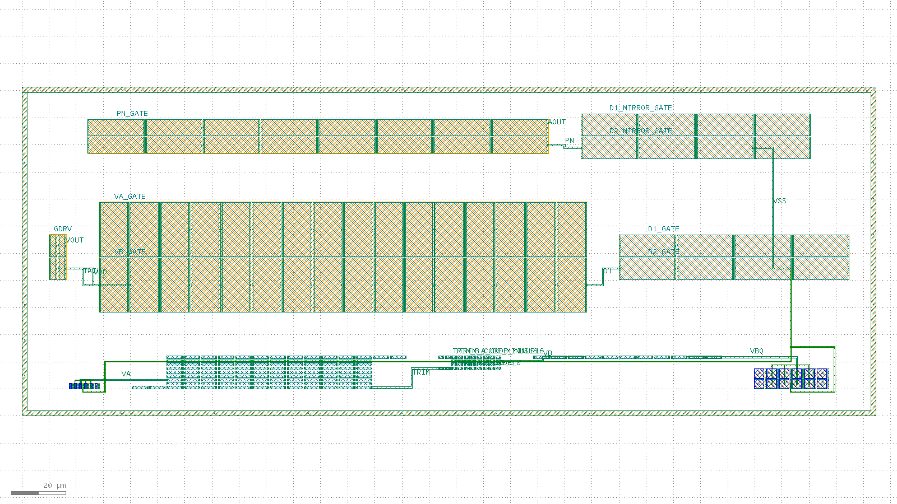

# Bandgap-core routed layout record: 20260804-012915-1a97bf5

Routed-and-extracted successor to the issue #15 placement-only floorplan skeleton (`layout/bandgap-core/reports/` earlier records). Read `layout/matching-plan.md` for the matching rationale this layout implements; this record is the measured evidence, not the rationale.

## Acceptance-criteria scoreboard (issue #62)

| # | Criterion | Status | Evidence |
| --- | --- | --- | --- |
| 1 | Full inter-block routing | PARTIAL | 4/12 **schematic** inter-block nets fully drawn (9/9 declared 2-pin hops routed, 0 unrouted) -- see "Schematic inter-block nets" below |
| 2 | Resistor ladder at real unit count | MET | `res_r2` num=108 (= 2 x n_r2=54); composed bbox 38,171 um^2 vs 50,000 um^2 budget |
| 3 | Extract: correct device classes + promoted pins | MET | device_counts={"nfet": 16, "pfet": 52, "pnp": 24, "res_generic_po": 159}, pin_count=23 |
| 4 | `klt lvs` clean | NOT MET | status=mismatch, mismatch_count=790 -- `combine_devices: true` crashed (2AMLogic/klayout-tools#466), this run's LVS is with `combine_devices: false` |
| 5 | Blocking `klt` gaps filed as friction | MET | 2AMLogic/klayout-tools#432 (PNP recognition marker, closed via #440 -- fixed natively, workaround retired), #433 (single routing metal, closed via #439 -- "fail visibly" only, capability gap re-raised as #454), #434 (no route into a guard-ringed block, closed via #441 -- restoring rings is a follow-up), #453 (new: #439's self-net check misses a same-row/same-direction short), #454 (new: no native metal2/via role, so bussing must be hand-drawn -- MANUAL_BUS_TECHNIQUE_NOTE), #466 (new: `combine_devices()` crashes on a partial-match device group -- COMBINE_DEVICES_CRASH_NOTE) |

- [x] DRC on the composed, routed layout is clean
- [x] Composed bbox area (38,171 um^2) is within the < 0.05 mm^2 (50,000 um^2) budget, **at the real 108-unit ladder count**

## Flow

1. `klt gen` once per matched device group (10 blocks).
2. `klt draw` once per PNP array -- an emitter-bus met1+mcon overlay, positioned from that block's own reported `ports[]` and verified by this flow's own extraction check, not just DRC (MANUAL_BUS_TECHNIQUE_NOTE).
3. `klt gen-compose` with `placement.strategy: "explicit"`, `connectivity[]` (routed 2-pin hops) and `pins[]` (labelled single-port nets) -- `compose.inner.request.json`.
4. `klt draw` twice more: the PNP-base-to-VSS bridge overlays, positioned from the inner pass's own resolved absolute coordinates (PNP_BASE_VSS_BRIDGE_NOTE), then a third `klt gen-compose` pass layering them onto the routed inner cell.
5. Guard ring `klt gen` + a fourth `klt gen-compose` pass -- `compose.request.json`.
6. `klt drc <composed> --deck sky130`.
7. `klt extract <composed> --deck sky130 --top bandgap_core_routed`.
8. `klt lvs` (`options.combine_devices: true`) against the xschem-derived reference netlist (issue #8).
9. `klt render` for the visual check below.

## Blocks

| id | generator | matched group | real target |
| --- | --- | --- | --- |
| `pnp_ctat` | `bjt_array` | Q1 (CTAT PNP, small unit W0p68L0p68) | m=8 sky130_fd_pr__pnp_05v5_W0p68L0p68 (design/bandgap_core.sch); drawn 1:1 (8 real units, 2x4 common-centroid) |
| `res_r2` | `res_array` | R2A/R2B interdigitated ladder (K = R2/R1 divider) | n_r2=54 unit segments PER LEG x 2 legs = 108 total (design/bandgap_core.sch); drawn 1:1 -- the skeleton's 16-unit reduction is closed here by `res_array`'s `rows` fold parameter (2AMLogic/klayout-tools#415, merged via #418) |
| `res_trim` | `res_array` | Downward-only trim ladder taps (both legs) | n_r2_trim range 0..-16 codes x 2 legs = 32 1um unit taps (design/bandgap_core.sch CORE_PARAMS, DR-002); drawn 1:1 |
| `res_r1` | `res_array` | R1 (dVBE-to-current leg) | n_r1=7 unit segments (design/bandgap_core.sch); drawn 1:1 |
| `pnp_ptat` | `bjt_array` | Q2 (PTAT PNP, large unit W3p40L3p40) | m=8 sky130_fd_pr__pnp_05v5_W3p40L3p40 (design/bandgap_core.sch); drawn 1:1 (8 real units, 2x4 common-centroid) |
| `core_mirror` | `diff_pair` | MPOUT/MPAMP (core PMOS output/bias mirror) | m_out=m_ampbias=2, W=8 L=2 (design/bandgap_core.sch); drawn 1:1 |
| `amp_input_pair` | `diff_pair` | MP1/MP2 (amp PMOS input pair) | amp_m_in=16, W=20 L=10 (design/error_amp.sch); drawn 1:1 -- the dominant mismatch contributor per layout/matching-plan.md Section 1 |
| `amp_nload` | `diff_pair` | MN1/MN2 (amp NMOS diode loads) | amp_m_nmirr=4, W=8 L=20 (design/error_amp.sch); drawn 1:1 |
| `amp_pmirr` | `diff_pair` | MP3/MP4 (amp PMOS mirror) | amp_m_pmirr=8, W=6 L=20 (design/error_amp.sch); drawn 1:1 |
| `amp_nmirr` | `diff_pair` | MN3/MN4 (amp NMOS mirror outputs) | amp_m_nmirr=4, W=8 L=20 (design/error_amp.sch); drawn 1:1 |

Note: MCC (amp compensation cap, amp_m_cc=16 x W=30 x L=20 = 9600 um^2) is single-ended and not drawn here, exactly as in the #15 skeleton; see layout/matching-plan.md's area-budget section for why

## Routed nets

| net | pins | routed | length (um) |
| --- | --- | --- | --- |
| `VA` | pnp_ctat.Q3_E -> res_r2.R24_A | yes | 33.63 |
| `TRIM` | res_r2.R11_B -> res_trim.R0_A | yes | 36.78 |
| `VB` | res_trim.R23_B -> res_r1.R1_A | yes | 32.84 |
| `VBQ` | res_r1.R6_B -> pnp_ptat.Q1_E | yes | 46.65 |
| `TAIL` | core_mirror.M2_1_D -> amp_input_pair.Q1_1_S | yes | 18.72 |
| `D1` | amp_input_pair.Q2_8_D -> amp_nload.M1_1_S | yes | 18.57 |
| `PN` | amp_nmirr.M1_1_S -> amp_pmirr.M2_4_D | yes | 13.57 |
| `VDD` | core_mirror.M2_1_S -> amp_input_pair.Q2_1_S | yes | 32.38 |
| `VSS` | amp_nload.M1_2_D -> amp_nmirr.M1_2_D | yes | 58.70 |

## Schematic inter-block nets: drawn vs. labelled only

The table above counts this flow's own `connectivity[]` declaration. This one counts what issue #62 actually asks for: every node of design/bandgap_core.sch (+ design/error_amp.sch) that joins devices in different blocks, and whether drawn metal joins **all** the blocks the schematic says it reaches. `klt gen-compose` routes 2-pin nets only, so a trunk can only be built as a chain of same-labelled hops -- and a hop is only certifiable when the two blocks are adjacent across an empty channel (ROUTING_LAYER_NOTE) -- this flow's PNP-base-to-VSS bridge overlays are the one exception, drawn by hand rather than through `gen-compose`'s router (PNP_BASE_VSS_BRIDGE_NOTE), so `VSS`'s coverage below includes them even though they are not `connectivity[]` hops. Everything else not drawn below exists in the layout as a promoted pin label, i.e. it is addressable but electrically open.

| schematic net | reaches (blocks) | joined by drawn metal | not drawn | status |
| --- | --- | --- | --- | --- |
| `VA` | `pnp_ctat`, `res_r2`, `amp_input_pair` | `pnp_ctat`, `res_r2` | `amp_input_pair` | **partial** |
| `VB` | `res_trim`, `res_r1`, `amp_input_pair` | `res_r1`, `res_trim` | `amp_input_pair` | **partial** |
| `TRIM` | `res_r2`, `res_trim` | `res_r2`, `res_trim` | -- | **drawn** |
| `VBQ` | `res_r1`, `pnp_ptat` | `pnp_ptat`, `res_r1` | -- | **drawn** |
| `VOUT` | `core_mirror`, `res_r2` | -- | `core_mirror`, `res_r2` | **labelled only** |
| `GDRV` | `core_mirror`, `amp_pmirr`, `amp_nmirr` | -- | `amp_nmirr`, `amp_pmirr`, `core_mirror` | **labelled only** |
| `TAIL` | `core_mirror`, `amp_input_pair` | `amp_input_pair`, `core_mirror` | -- | **drawn** |
| `D1` | `amp_input_pair`, `amp_nload`, `amp_nmirr` | `amp_input_pair`, `amp_nload` | `amp_nmirr` | **partial** |
| `D2` | `amp_input_pair`, `amp_nload`, `amp_nmirr` | -- | `amp_input_pair`, `amp_nload`, `amp_nmirr` | **labelled only** |
| `PN` | `amp_nmirr`, `amp_pmirr` | `amp_nmirr`, `amp_pmirr` | -- | **drawn** |
| `VDD` | `core_mirror`, `amp_input_pair`, `amp_pmirr` | `amp_input_pair`, `core_mirror` | `amp_pmirr` | **partial** |
| `VSS` | `amp_nload`, `amp_nmirr`, `pnp_ctat`, `pnp_ptat`, `res_r2`, `res_trim`, `res_r1` | `amp_nload`, `amp_nmirr`, `pnp_ctat`, `pnp_ptat` | `res_r1`, `res_r2`, `res_trim` | **partial** |

**4 of 12 schematic inter-block nets are fully drawn.** Criterion 1 is therefore scored PARTIAL, not MET, whenever that count is short: `VA` reaches 2 of its 3 blocks; `VB` reaches 2 of its 3 blocks; `VOUT` is labelled-only, no blocks joined; `GDRV` is labelled-only, no blocks joined; `D1` reaches 2 of its 3 blocks; `D2` is labelled-only, no blocks joined; `VDD` reaches 2 of its 3 blocks; `VSS` reaches 4 of its 7 blocks. `res_high_po` (R2A/R2B/R1's bulk) is a 3-terminal device tied to `VSS` in the schematic, and this table states what the *schematic* requires even where the 2-terminal `res_generic_po` reference cards cannot carry it -- separately, that bulk tie is automatically satisfied regardless of routing, since a resistor's bulk terminal ties to the same global native-substrate node every device shares (`bulk_to_substrate=True`), not to a drawn `VSS` wire. ROUTING_LAYER_NOTE is what caps the rest of this criterion.

## Promoted top-level pins

`klt gen-compose` labelled 14/14 requested `pins[]` ports; `klt extract` promoted **23** top-level pins (the #15 skeleton promoted `pin_count: 0`).

| net | port | labelled |
| --- | --- | --- |
| `GDRV` | core_mirror.M2_2_G | yes |
| `VOUT` | core_mirror.M1_2_D | yes |
| `VA_GATE` | amp_input_pair.Q2_9_G | yes |
| `VB_GATE` | amp_input_pair.Q1_1_G | yes |
| `D1_GATE` | amp_nload.M2_3_G | yes |
| `D2_GATE` | amp_nload.M1_1_G | yes |
| `D1_MIRROR_GATE` | amp_nmirr.M2_3_G | yes |
| `D2_MIRROR_GATE` | amp_nmirr.M1_1_G | yes |
| `PN_GATE` | amp_pmirr.M2_5_G | yes |
| `AOUT` | amp_pmirr.M1_8_D | yes |
| `TRIM_A_CODE_0` | res_trim.R0_B | yes |
| `TRIM_A_CODE_MINUS16` | res_trim.R30_B | yes |
| `TRIM_B_CODE_0` | res_trim.R1_B | yes |
| `TRIM_B_CODE_MINUS16` | res_trim.R31_B | yes |

## Results

| Stage | Status | Detail |
| --- | --- | --- |
| compose | routed | nets=9, unrouted=0 |
| DRC | clean | violation_count=0 |
| extract | ok | device_count=251, device_counts={"nfet": 16, "pfet": 52, "pnp": 24, "res_generic_po": 159}, pin_count=23 |
| LVS | mismatch | mismatch_count=790 |

### Extracted device classes vs. the #15 skeleton

| class | this record | #15 skeleton |
| --- | --- | --- |
| `pnp` | 24 | 0 |
| `nfet` | 16 | 0 |
| `pfet` | 52 | 68 |
| `res_generic_po` | 159 | 67 |
| promoted pins | 23 | 0 |

### LVS mismatch analysis

| | layout | reference | matched |
| --- | --- | --- | --- |
| nets | 511 | 11 | 0 |
| devices | 251 | 16 | 0 |
| pins | 23 | 4 | 27 |

Mismatch categories: `{"device.body_unverified": 1, "device.unmatched": 267, "net.unmatched": 522}`.

This flow now busses the PNP arrays' emitters and bridges their shared base to VSS (MANUAL_BUS_TECHNIQUE_NOTE) and runs `klt lvs` with `options.combine_devices: true`, so a correctly-bussed group of parallel devices *can* collapse into the reference's single multiplicity-N device -- this is the mechanism that was entirely absent from the prior increment (PR #64), where every matched-group unit stayed both un-bussed and un-combined. What remains unmatched below is what that mechanism does not reach: every `diff_pair` block's split/mirrored MOS fingers (S/D/G) are not bussed -- the same technique was attempted there and reverted as unsafe (MOS_FINGER_BUS_NOTE), R2A/R2B/R1's 159 series-resistor segments are still not bussed at all (RESISTOR_CHAIN_NOTE -- a series chain, not a parallel bus, is a different and larger drawing problem left to a follow-up), `MMCC` (the amp's compensation cap) is in the reference but deliberately not drawn in this layout (see the Blocks note above), and the schematic inter-block nets still left as labelled-only pins in the table above (`VOUT`, `GDRV`/`AOUT`, `D2`, and any unjoined legs of `VDD`/`VSS`/`VA`/`VB`/`D1`) are single reference nodes the layout still carries as two or more open nodes. None of these are errors in the reference netlist, and none are accommodated in it: `reference.spice` states the schematic, and the gaps are recorded here, not papered over by rewriting the reference to match the layout's own remaining un-bussed/un-routed structure.

## Visual verification

## What this record does NOT claim

- **Not LVS-clean.** `klt lvs` reports `mismatch` with `mismatch_count=790` against the xschem-derived reference netlist, even with `options.combine_devices: true`. R2A/R2B/R1's unit segments are not bussed in this flow. Each is 2-pin (head/tail), and the schematic's single lumped resistor represents them wired in series -- unlike a parallel bus (many pads, one shared node), a series chain needs a distinct 2-pin hop between each adjacent pair's tail and the next pair's head, repeated across a 9-row fold boundary the ladder's `rows` parameter introduces. That is a materially different (and, at 108 units, much larger) drawing problem than the parallel bus this flow's build_bus_overlay() draws for PNP emitters, and is left to a follow-up rather than attempted at reduced confidence in this increment. See the "LVS mismatch analysis" section above for what else, if anything, remains beyond that -- not a layout choice.
- **Not fully inter-block routed either.** 4/12 schematic inter-block nets are joined across every block they reach; the rest are promoted pin labels with no metal between them (`VOUT` never reaches the ladder, `AOUT`/`GDRV` are two pins where the schematic has one node, `D2` is undrawn, and the `VDD`/`VSS` trunks each stop short of blocks they supply). `klt gen-compose` routes 2-pin nets between blocks adjacent across an empty channel only, so a trunk is a chain of hops and a non-adjacent pair is unroutable -- ROUTING_LAYER_NOTE. Criterion 1 is scored PARTIAL on this basis, against the schematic's node list rather than this flow's own declaration.
- **Intra-block bussing is drawn for PNP emitters only.** Each PNP array's 8 real emitters are bussed by hand on met1+mcon and verified by this flow's own extraction check on every run, not just DRC (MANUAL_BUS_TECHNIQUE_NOTE) -- and each array's shared base is bridged to VSS the same way (PNP_BASE_VSS_BRIDGE_NOTE). `diff_pair` MOS fingers are not bussed -- attempted and reverted as unsafe (MOS_FINGER_BUS_NOTE). R2A/R2B/R1's 159 series-resistor segments are not bussed either -- RESISTOR_CHAIN_NOTE.
- **Per-matched-group guard rings are off.** `klt gen-compose`'s router rejects any route to a non-tap port on a block that reports a guard/collector ring, because the route would cross the ring's own metal loop. 2AMLogic/klayout-tools#434 (merged via #441) added a ring-routing opening upstream, but restoring the per-matched-group rings this flow still keeps off is left to a follow-up so this increment's scope stays on bussing. This flow drops the per-group rings (keeping the cell-level ring) so connectivity can be drawn at all, a matching-quality regression relative to the #15 skeleton that is recorded in layout/matching-plan.md Section 5. The cell-level ring is still drawn and DRC-checked.
- **The PNP devices are recognition-marked drawn geometry, not vendor `pnp_05v5` cell instances.** `klt gen bjt_array` draws a matching-faithful floorplan from base layers by design (its own generator note says so); its native marker/tap (2AMLogic/klayout-tools#440) makes that geometry *extract* as `pnp`, not a SPICE-model-exact device.

## Provenance

- Record ID: `20260804-012915-1a97bf5`
- `klt` version: `klt 0.1.0` (pinned, see `layout/requirements.txt`)
- KLayout engine version: `0.30.10`
- Repo state: `1a97bf5ab87aa1c3ace920cd416e83c52e0ddccf` on `feature/issue-62` (dirty)

## Links

- [`compose.request.json`](compose.request.json), [`compose.json`](compose.json)
- [`drc.json`](drc.json), [`extract.json`](extract.json), [`lvs.json`](lvs.json)
- [`bandgap_core_routed.extract.spice`](bandgap_core_routed.extract.spice), [`reference.spice`](reference.spice)
- [`bandgap_core_routed.gds`](bandgap_core_routed.gds)
- [`render.json`](render.json), [`renders/overview.png`](renders/overview.png)
