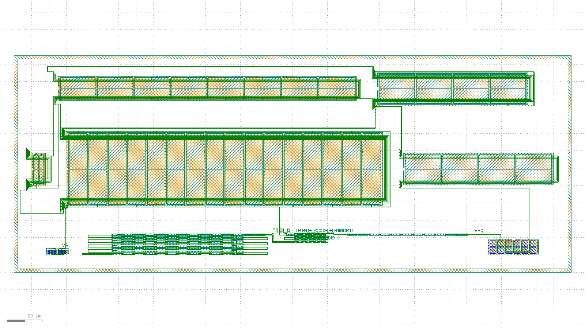

# Bandgap-core routed layout record: 20260804-032842-27656fb

Routed-and-extracted successor to the issue #15 placement-only floorplan skeleton (`layout/bandgap-core/reports/` earlier records). Read `layout/matching-plan.md` for the matching rationale this layout implements; this record is the measured evidence, not the rationale.

## Acceptance-criteria scoreboard (issue #62)

| # | Criterion | Status | Evidence |
| --- | --- | --- | --- |
| 1 | Full inter-block routing | PARTIAL | 8/12 **schematic** inter-block nets fully drawn (9/13 declared met1 nets routed, 4 unrouted) -- see "Schematic inter-block nets" below |
| 2 | Resistor ladder at real unit count | MET | `res_r2` num=108 (= 2 x n_r2=54); composed bbox 40,019 um^2 vs 50,000 um^2 budget |
| 3 | Extract: correct device classes + promoted pins | MET | device_counts={"nfet": 16, "pfet": 52, "pnp": 24, "res_generic_po": 159}, pin_count=17 |
| 4 | `klt lvs` clean | NOT MET | status=mismatch, mismatch_count=85 |
| 5 | Blocking `klt` gaps filed as friction | MET | 2AMLogic/klayout-tools#461 (MOS gate poly has no contact landing area) is worked around here rather than waited on -- see MOS_GATE_NOTE -- and #484 records the second half of the same gap (`diff_pair`'s fixed ring padding / row pitch leave room for one gate contact row per side). Still open and still costing mismatches: #462 (dummy-device marker is MOS-gate-only, not bipolar/resistor), #463 (sky130 `res_array` cannot draw non-default resistor flavours), #454 (no metal2/via role, so every wire here is hand-drawn) |

- [x] DRC on the composed, routed layout is clean
- [x] Composed bbox area (40,019 um^2) is within the < 0.05 mm^2 (50,000 um^2) budget, **at the real 108-unit ladder count**

## Flow

1. `klt gen` once per matched device group (10 blocks).
2. `klt draw` once, for the whole cell: every intra-block bus and every inter-block net, on met1 over mcon, plus one met1 net label each -- `bandgap_core_bus.draw.json`, summarised in `bus-summary.json`.
3. `klt gen-compose` with `placement.strategy: "explicit"`, an empty `connectivity[]` (routing is on met1, above) and `pins[]` for the label-only nodes -- `compose.request.json`.
4. `klt drc <composed> --deck sky130`.
5. `klt extract <composed> --deck sky130 --top bandgap_core_routed`.
6. `klt lvs` against the xschem-derived reference netlist (issue #8), twice -- with and without `options.combine_devices`.
7. `klt render` for the visual check below.

## Blocks

| id | generator | matched group | real target |
| --- | --- | --- | --- |
| `pnp_ctat` | `bjt_array` | Q1 (CTAT PNP, small unit W0p68L0p68) | m=8 sky130_fd_pr__pnp_05v5_W0p68L0p68 (design/bandgap_core.sch); drawn 1:1 (8 real units, 2x4 common-centroid) |
| `res_r2` | `res_array` | R2A/R2B interdigitated ladder (K = R2/R1 divider) | n_r2=54 unit segments PER LEG x 2 legs = 108 total (design/bandgap_core.sch); drawn 1:1 -- the skeleton's 16-unit reduction is closed here by `res_array`'s `rows` fold parameter (2AMLogic/klayout-tools#415, merged via #418) |
| `res_trim` | `res_array` | Downward-only trim ladder taps (both legs) | n_r2_trim range 0..-16 codes x 2 legs = 32 1um unit taps (design/bandgap_core.sch CORE_PARAMS, DR-002); drawn 1:1 |
| `res_r1` | `res_array` | R1 (dVBE-to-current leg) | n_r1=7 unit segments (design/bandgap_core.sch); drawn 1:1 |
| `pnp_ptat` | `bjt_array` | Q2 (PTAT PNP, large unit W3p40L3p40) | m=8 sky130_fd_pr__pnp_05v5_W3p40L3p40 (design/bandgap_core.sch); drawn 1:1 (8 real units, 2x4 common-centroid) |
| `core_mirror` | `diff_pair` | MPOUT/MPAMP (core PMOS output/bias mirror) | m_out=m_ampbias=2, W=8 L=2 (design/bandgap_core.sch); drawn 1:1 |
| `amp_input_pair` | `diff_pair` | MP1/MP2 (amp PMOS input pair) | amp_m_in=16, W=20 L=10 (design/error_amp.sch); drawn 1:1 -- the dominant mismatch contributor per layout/matching-plan.md Section 1 |
| `amp_nload` | `diff_pair` | MN1/MN2 (amp NMOS diode loads) | amp_m_nmirr=4, W=8 L=20 (design/error_amp.sch); drawn 1:1 |
| `amp_pmirr` | `diff_pair` | MP3/MP4 (amp PMOS mirror) | amp_m_pmirr=8, W=6 L=20 (design/error_amp.sch); drawn 1:1 |
| `amp_nmirr` | `diff_pair` | MN3/MN4 (amp NMOS mirror outputs) | amp_m_nmirr=4, W=8 L=20 (design/error_amp.sch); drawn 1:1 |

Note: MCC (amp compensation cap, amp_m_cc=16 x W=30 x L=20 = 9600 um^2) is single-ended and not drawn here, exactly as in the #15 skeleton; see layout/matching-plan.md's area-budget section for why

## Intra-block busses drawn on met1

Each matched array's units are tied into the node the schematic says they form, on met1 over mcon -- the sky130 extraction deck's own second conductor and via (`metals = (li1, met1)`, `vias = (mcon,)`). The li1 router cannot express these at all (2AMLogic/klayout-tools#433 and its merged fix #439, which made the failure visible rather than expressible), so this flow draws them itself from each block's reported `ports[]`. This is what turns a 108-segment ladder into two real series resistors and an 8-unit PNP array into one real m=8 device.

| block | bus | detail |
| --- | --- | --- |
| `pnp_ctat` | parallel unit bus | `VA` = 8 pads on 4 columns; `VSS` = 8 pads on 4 columns |
| `res_r2` | 2 interdigitated series string(s) | 106 unit-to-unit met1 links |
| `res_trim` | 2 interdigitated series string(s) | 30 unit-to-unit met1 links |
| `res_r1` | 1 interdigitated series string(s) | 6 unit-to-unit met1 links |
| `pnp_ptat` | parallel unit bus | `VBQ` = 8 pads on 4 columns; `VSS` = 8 pads on 4 columns |
| `core_mirror` | matched-pair lane bus | 4 unit devices on 4 lanes (`GDRV`, `VDD`, `VOUT`, `TAIL`); 4 self-drawn gate contacts (4 inboard lane); guard ring tied to `VDD` |
| `amp_input_pair` | matched-pair lane bus | 32 unit devices on 5 lanes (`VB`, `TAIL`, `D1`, `D2`, `VDD`); 32 self-drawn gate contacts (16 inboard lane, 16 outboard trunk); guard ring tied to `VDD` |
| `amp_nload` | matched-pair lane bus | 8 unit devices on 3 lanes (`D1`, `VSS`, `D2`); 8 self-drawn gate contacts (8 li1 bond to S); guard ring tied to `VSS` |
| `amp_pmirr` | matched-pair lane bus | 16 unit devices on 3 lanes (`PN`, `VDD`, `GDRV`); 24 self-drawn gate contacts (16 inboard lane, 8 li1 bond to D); guard ring tied to `VDD` |
| `amp_nmirr` | matched-pair lane bus | 8 unit devices on 4 lanes (`D1`, `VSS`, `GDRV`, `PN`); 8 self-drawn gate contacts (4 inboard lane, 4 outboard trunk); guard ring tied to `VSS` |

Drawn-short / spacing proof: every met1 rectangle carries the electrical node it belongs to, and **0** pairs of rectangles belonging to *different* nodes come within the deck's 0.14 um `met1.space.1` clearance. The flow fails on any nonzero count -- a drawn short the DRC deck happens not to model would otherwise read as connectivity.

Poly-spacing proof: **0** pairs of self-drawn gate-contact poly extensions belonging to different nodes come within sky130's own 0.21 um `poly.2` minimum poly spacing -- a rule the curated DRC deck does not model, so `klt drc` alone could not have caught one. The flow fails on any nonzero count.

Per-node connectivity proof: every node's drawn met1 is one connected conductor, except the 4 listed here, which close through li1 or are joined by an inter-block hop that did not route: `{"D2": 3, "VB": 2, "VOUT": 2, "VSS": 3}`.

## Inter-block nets drawn on met1

| net | terminals | routed | schematic node |
| --- | --- | --- | --- |
| `GDRV` | `core_mirror:GDRV trunk` + `amp_pmirr:GDRV trunk` + `amp_nmirr:GDRV trunk` | yes | the amp's output (MP4/MN3 drains) and the core mirror's gate drive -- one node in the schematic |
| `TAIL` | `core_mirror:TAIL trunk` + `amp_input_pair:TAIL trunk` | yes | MPAMP drain to the amp input pair's common source |
| `D1` | `amp_input_pair:D1 trunk` + `amp_nmirr:D1 trunk` + `amp_nload:D1 trunk` | yes | MP1 drain to its NMOS diode load and on to MN3's gate |
| `D2` | `amp_input_pair:D2 trunk` + `amp_nload:D2 trunk` + `amp_nmirr:D2 trunk` | NO | MP2 drain to its NMOS diode load and on to MN4's gate |
| `PN` | `amp_pmirr:PN trunk` + `amp_nmirr:PN trunk` | yes | MN4 drain to the diode-connected MP3 and MP4's gate |
| `VA` | `pnp_ctat:VA trunk` + `amp_input_pair:VA trunk` + `res_trim.R30_B` | yes | the R2A leg's low end (through its trim taps) to Q1's emitter bus and MP2's gate -- the amp's VINN node |
| `TRIM_A` | `res_r2.R106_B` + `res_trim.R0_A` | yes | R2A's low end into leg A of the downward-only trim ladder (DR-002) |
| `VOUT` | `core_mirror:VOUT trunk` + `res_r2.R0_A` + `res_r2.R1_A` | NO | MPOUT's drain and the high ends of both divider legs -- the reference output |
| `TRIM_B` | `res_r2.R107_B` + `res_trim.R1_A` | yes | R2B's low end into leg B of the trim ladder |
| `VB` | `amp_input_pair:VB trunk` + `res_trim.R31_B` + `res_r1.R0_A` | NO | the R2B leg's low end (through its trim taps) to R1's head and MP1's gate -- the amp's VINP node |
| `VBQ` | `res_r1.R6_B` + `pnp_ptat:VBQ trunk` | yes | R1's tail to Q2's emitter bus |
| `VSS` | `pnp_ctat:VSS trunk` + `amp_nmirr:VSS trunk` + `amp_nload:VSS trunk` + `pnp_ptat:VSS trunk` | NO | VSS trunk: the amp's NMOS rails and guard rings plus both PNP base ties (the diode-connected PNPs' base and collector both sit on VSS) |
| `VDD` | `core_mirror:VDD trunk` + `amp_pmirr:VDD trunk` + `amp_input_pair:VDD trunk` | yes | VDD trunk across all three PMOS groups -- MPOUT/MPAMP and MP3/MP4 sources, and MP1/MP2's own n-well tie (the input pair's bulk terminal, which its sources do not carry) |

## Schematic inter-block nets: drawn vs. labelled only

The table above counts this flow's own routing declaration. This one counts what issue #62 actually asks for: every node of design/bandgap_core.sch (+ design/error_amp.sch) that joins devices in different blocks, and whether drawn metal joins **all** the blocks the schematic says it reaches. A node scored `partial` is drawn between some of its blocks and named, so it is addressable, but it is not connected -- every remaining gap is a hop this flow's own met1 router could not place without a drawn short, not a node it is unable to express.

| schematic net | reaches (blocks) | joined by drawn metal | not drawn | status |
| --- | --- | --- | --- | --- |
| `VA` | `pnp_ctat`, `res_trim`, `amp_input_pair` | `amp_input_pair`, `pnp_ctat`, `res_trim` | -- | **drawn** |
| `VB` | `res_trim`, `res_r1`, `amp_input_pair` | -- | `amp_input_pair`, `res_r1`, `res_trim` | **labelled only** |
| `TRIM` | `res_r2`, `res_trim` | `res_r2`, `res_trim` | -- | **drawn** |
| `VBQ` | `res_r1`, `pnp_ptat` | `pnp_ptat`, `res_r1` | -- | **drawn** |
| `VOUT` | `core_mirror`, `res_r2` | -- | `core_mirror`, `res_r2` | **labelled only** |
| `GDRV` | `core_mirror`, `amp_pmirr`, `amp_nmirr` | `amp_nmirr`, `amp_pmirr`, `core_mirror` | -- | **drawn** |
| `TAIL` | `core_mirror`, `amp_input_pair` | `amp_input_pair`, `core_mirror` | -- | **drawn** |
| `D1` | `amp_input_pair`, `amp_nload`, `amp_nmirr` | `amp_input_pair`, `amp_nload`, `amp_nmirr` | -- | **drawn** |
| `D2` | `amp_input_pair`, `amp_nload`, `amp_nmirr` | -- | `amp_input_pair`, `amp_nload`, `amp_nmirr` | **labelled only** |
| `PN` | `amp_nmirr`, `amp_pmirr` | `amp_nmirr`, `amp_pmirr` | -- | **drawn** |
| `VDD` | `core_mirror`, `amp_input_pair`, `amp_pmirr` | `amp_input_pair`, `amp_pmirr`, `core_mirror` | -- | **drawn** |
| `VSS` | `amp_nload`, `amp_nmirr`, `pnp_ctat`, `pnp_ptat`, `res_r2`, `res_trim`, `res_r1` | -- | `amp_nload`, `amp_nmirr`, `pnp_ctat`, `pnp_ptat`, `res_r1`, `res_r2`, `res_trim` | **labelled only** |

**8 of 12 schematic inter-block nets are fully drawn.** Criterion 1 is scored PARTIAL, not MET, whenever that count is short. `VSS`'s block list includes the three resistor blocks because the *schematic* uses `res_high_po`, a 3-terminal device whose bulk ties to VSS; the layout can only draw the 2-terminal `res_generic_po` (RES_FLAVOR_NOTE), so those three have no bulk terminal to reach and this table states the schematic's requirement rather than quietly dropping it.

## Promoted top-level pins

`klt gen-compose` labelled 4/4 requested `pins[]` ports; `klt extract` promoted **17** top-level pins (the #15 skeleton promoted `pin_count: 0`).

| net | port | labelled |
| --- | --- | --- |
| `TRIM_A_CODE_0` | res_trim.R0_B | yes |
| `TRIM_A_CODE_MINUS16` | res_trim.R30_B | yes |
| `TRIM_B_CODE_0` | res_trim.R1_B | yes |
| `TRIM_B_CODE_MINUS16` | res_trim.R31_B | yes |

## Results

| Stage | Status | Detail |
| --- | --- | --- |
| met1 routing | partial | nets=13, unrouted=4, drawn-short conflicts=0 |
| DRC | clean | violation_count=0 |
| extract | ok | device_count=251, device_counts={"nfet": 16, "pfet": 52, "pnp": 24, "res_generic_po": 159}, pin_count=17 |
| LVS | mismatch | mismatch_count=85 |

### Extracted device classes vs. the #15 skeleton

| class | this record | #15 skeleton |
| --- | --- | --- |
| `pnp` | 24 | 0 |
| `nfet` | 16 | 0 |
| `pfet` | 52 | 68 |
| `res_generic_po` | 159 | 67 |
| promoted pins | 17 | 0 |

### LVS mismatch analysis

| run | `combine_devices` | status | mismatches |
| --- | --- | --- | --- |
| combined | True | mismatch | 85 |
| uncombined | False | mismatch | 473 |

| | layout | reference | matched |
| --- | --- | --- | --- |
| nets | 194 | 11 | 1 |
| devices | 38 | 16 | 5 |
| pins | 17 | 4 | 18 |

Device counts here are **after** `klt lvs`'s `options.combine_devices` has folded both sides (this increment turns it on): the layout's series ladder segments and parallel array units collapse into the lumped devices the schematic states, which is only possible because the busses above are actually drawn. `klt extract` saw 251 drawn devices; the comparison sees 38.

Mismatch categories: `{"device.unmatched": 39, "net.merged": 2, "net.split": 44}`.

The residual gap has five disclosed causes, none of them a topology error in either netlist:

1. **Inter-block nets still unrouted:** `D2`, `VOUT`, `VB`, `VSS`. Each is a schematic node whose terminals this flow's met1 router could not join without a drawn short, so it is left open rather than certified. See the inter-block table above for which hop failed and what blocked it. This is now the dominant term: unlike the previous increment's blockers it is a *routing-quality* limit of this repo's own hand-written router, not an upstream tool gap.
2. **Dummy devices cannot be declared.** Neither curated extraction deck declares an `ExtractionDeck.dummy` marker layer, and no `klt gen` generator draws one, so a matched array's dummy edge units extract as ordinary devices with no schematic counterpart. The suppression path that does exist (added for klayout-tools#295) is also MOS-gate-only -- it can never drop a dummy resistor or a dummy bipolar. Turning dummies off to make LVS count would be a matching regression this flow refuses to take.
3. **The resistor flavour cannot be drawn.** `klt gen res_array` on sky130 can only draw the base `res_generic_po` flavour: the generator's `res_implant`/`res_block` layer roles are None for the sky130 family, while the same tool's sky130 extraction deck recognises three flavours (`res_generic_po` 48.2, `res_high_po` 319.8, `res_xhigh_po` 2000 ohm/sq) distinguished by implant masks the generator never draws. A schematic built on a higher-sheet-rho flavour -- as this one is -- therefore cannot be laid out with a matching device class, and `klt lvs` has no parameter tolerance knob to absorb the difference. The reference states the schematic's device; the layout draws the only flavour the generator can.
4. **`MMCC`, the amp's compensation cap, is in the reference but deliberately not drawn in this layout** (see the Blocks note above), so one reference device has no layout counterpart by construction.
5. **The gate-contact workaround is this flow's, not the tool's.** Every `klt gen` MOS generator on sky130 (`diff_pair`, `mos_array`) draws the gate poly with exactly the active region's extent -- the poly and diff rectangles share both their top and bottom edges -- and reports the gate port on that shared boundary (2AMLogic/klayout-tools#461, still open). There is no poly landing area outside the channel on which a contact could be placed: a contact at the reported gate port straddles the diff edge (the curated deck flags it under `poly.enclosing.licon.1` and `diff.enclosing.licon.1`), and a contact moved inward sits on poly over the channel. This flow therefore draws the missing piece itself, from the generator's own reported gate port: a poly extension of the port's reported width past the active edge, then licon/li1 on it -- the same overhang every real foundry PDK draws for exactly this purpose (see met1_bus.Met1Bus.gate_landing). That is a layout-side workaround, not a substitute for the generator drawing it: the extension's size and direction are chosen here, per block, from geometry this repo derives, and the room available for it is set by two other fixed generator constants (MOS_BAND_NOTE). 2AMLogic/klayout-tools#484: `klt gen diff_pair`'s guard-ring padding (0.5 um) and inter-row spacing (0.4 um) are module constants with no parameter, and both are far too small to bring a matched block's two gate nets out: one gate contact stack (poly extension + licon + li1 pad, ~0.35 um) plus the real sky130 poly-to-poly spacing already exceeds the band, so the second gate net cannot get a second contact row on the same side. This flow works around it by giving each block at most one *inboard* routed gate net (stubbed to the innermost lane) and routing the other one *outboard*, past the guard ring, and by bonding a diode-connected device's gate straight to its own pad on li1. That covers this circuit's five matched groups but not the general case: a group whose two devices both need an independent, non-diode gate on a block with more than two rows has nowhere left to go.

None of the five is worked around by editing the reference netlist. `reference.spice` states design/bandgap_core.sch; rewriting it to enumerate the layout's own shortfalls would make LVS compare the layout against itself, which is not evidence.

## Visual verification

## What this record does NOT claim

- **Not LVS-clean.** `klt lvs` reports `mismatch` with `mismatch_count=85` against the xschem-derived reference netlist. See the five disclosed causes above; the largest is this flow's own router leaving 4 declared net(s) undrawn.
- **Not fully inter-block routed either.** 8/12 schematic inter-block nets are joined across every block they reach. The rest are drawn in part and named, so they are addressable, but they are not connected.
- **The gate contacts are drawn by this flow, not by `klt gen`.** Every MOS gate here is contacted through a poly extension this repo draws past the active edge from the generator's own reported gate port, because no sky130 MOS generator leaves one (2AMLogic/klayout-tools#461, still open). The extension is DRC-clean under the curated deck and is what every real PDK draws, but it is a workaround: its size, direction and the room it has to fit in are decided here, per block, not by the tool.
- **Not every matched device's gates could be bussed the same way.** `diff_pair`'s guard-ring padding and inter-row spacing are fixed constants with no parameter, and the band they leave holds exactly one gate contact row per side. This circuit's five matched groups fit (one inboard gate net, one outboard, diode-connected gates bonded locally on li1) -- a group needing two independent non-diode gate nets on a taller stack would not.
- **The PNP devices are drawn geometry recognised by the deck, not vendor `pnp_05v5` cell instances.** `klt gen bjt_array` draws a matching-faithful floorplan from base layers by design, and since upstream klayout-tools#440 it draws sky130's bipolar marker and per-unit well tap itself -- which makes the geometry *extract* as `pnp`, not a SPICE-model-exact device.
- **Array dummies are counted as real devices.** The `pnp` and `res_generic_po` counts above include each array's dummy edge units, which have no schematic counterpart and cannot be marked as dummies (cause 2 above). Turning dummies off would trade a real matching property for a smaller mismatch number; this flow keeps them.

## Provenance

- Record ID: `20260804-032842-27656fb`
- `klt` version: `klt 0.1.0` (pinned, see `layout/requirements.txt`)
- KLayout engine version: `0.30.10`
- Repo state: `27656fb7df670dc2c0722819e1a41e04797acc5e` on `feature/issue-62` (dirty)

## Links

- [`compose.request.json`](compose.request.json), [`compose.json`](compose.json)
- [`drc.json`](drc.json), [`extract.json`](extract.json), [`lvs.combined.json`](lvs.combined.json), [`lvs.json`](lvs.json)
- [`bus-summary.json`](bus-summary.json)
- [`bandgap_core_routed.extract.spice`](bandgap_core_routed.extract.spice), [`reference.spice`](reference.spice)
- [`bandgap_core_routed.gds`](bandgap_core_routed.gds)
- [`render.json`](render.json), [`renders/overview.png`](renders/overview.png)
