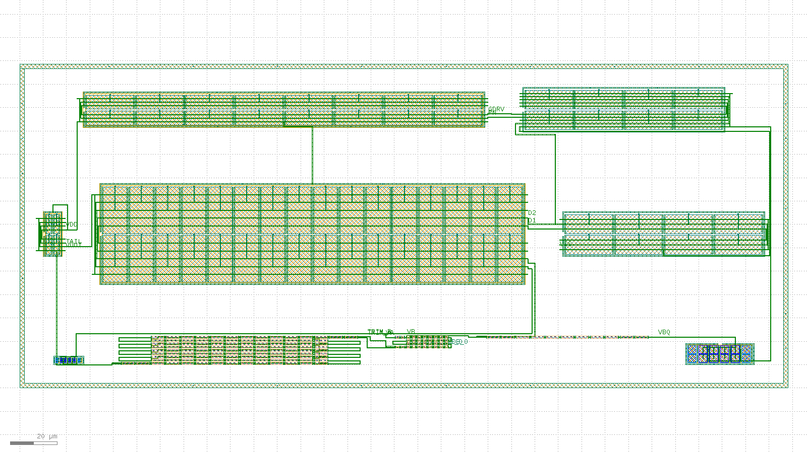

# Bandgap-core routed layout record: 20260804-181651-f3b2b2e

Routed-and-extracted successor to the issue #15 placement-only floorplan skeleton (`layout/bandgap-core/reports/` earlier records). Read `layout/matching-plan.md` for the matching rationale this layout implements; this record is the measured evidence, not the rationale.

## Acceptance-criteria scoreboard (issue #62)

| # | Criterion | Status | Evidence |
| --- | --- | --- | --- |
| 1 | Full inter-block routing | PARTIAL | 9/12 **schematic** inter-block nets fully drawn (10/13 declared met1 nets routed, 3 unrouted) -- see "Schematic inter-block nets" below |
| 2 | Resistor ladder at real unit count | MET | `res_r2` num=108 (= 2 x n_r2=54); composed bbox 45,508 um^2 vs 50,000 um^2 budget |
| 3 | Extract: correct device classes + promoted pins | MET | device_counts={"nfet": 16, "pfet": 52, "pnp": 16, "res_high_po": 147}, pin_count=15 |
| 4 | `klt lvs` clean | NOT MET | status=mismatch, mismatch_count=32 |
| 5 | Blocking `klt` gaps filed as friction | MET | every previously named gap is now CLOSED upstream and this record is the re-run against them: 2AMLogic/klayout-tools#461 via #474, #462 via #471, #463 via #475, #454 via #468, #470 via #481, #490 via #495, #491 via #494, #492 via #497/#498, #504 via #505 (a `bulk_to_substrate` resistor still extracts with one more terminal than the same device read from a plain-element reference, so no resistor can ever be paired -- #505's fix is a dedicated `device.class_arity` diagnostic, a deliberately-deferred partial close per its own acceptance criteria, not a fix that lets the two classes match; see RES_BULK_ARITY_NOTE). The actual reconciliation #504 itself proposed is filed separately as 2AMLogic/klayout-tools#506 (open) |

- [x] DRC on the composed, routed layout is clean
- [x] Composed bbox area (45,508 um^2) is within the < 0.05 mm^2 (50,000 um^2) budget, **at the real 108-unit ladder count**

## Flow

1. `klt gen` once per matched device group (10 blocks).
2. `klt draw` once, for the whole cell: every intra-block bus and every inter-block net, on met1 over mcon, plus one met1 net label each -- `bandgap_core_bus.draw.json`, summarised in `bus-summary.json`.
3. `klt gen-compose` with `placement.strategy: "explicit"`, an empty `connectivity[]` (routing is on met1, above) and `pins[]` for the label-only nodes -- `compose.request.json`.
4. `klt drc <composed> --deck sky130`.
5. `klt extract <composed> --deck sky130 --top bandgap_core_routed`.
6. `klt lvs` against the xschem-derived reference netlist (issue #8), twice -- with and without `options.combine_devices`.
7. `klt render` for the visual check below.

## Device-half binding

A `klt gen diff_pair` reports its two transistors as two port families (`M1_*`/`M2_*`, or `Q1_*`/`Q2_*` when `mirror` is false). Which family is which schematic device is *this flow's* choice, not the generator's -- the halves are geometrically interchangeable. Until this increment that choice was never made: every net picked whichever candidate pad sat nearest its own centroid, independently. Two consequences were live in the previous record. `PN` took a finger of the same amp_pmirr half the `AOUT` label named, so MP3's drain and MP4's drain were the same physical transistor; and amp_nload's `D1` route and `D1_GATE` label disagreed about which half is MN1. Neither is visible to DRC or to the drawn-short check -- every terminal involved is legal, well-separated metal.

| block | port family | schematic device | drain pad | source pad |
| --- | --- | --- | --- | --- |
| `core_mirror` | `M1_*` | `MPOUT` | `M1_*_D` | `M1_*_S` |
| `core_mirror` | `M2_*` | `MPAMP` | `M2_*_D` | `M2_*_S` |
| `amp_input_pair` | `Q2_*` | `MP1` | `Q2_*_D` | `Q2_*_S` |
| `amp_input_pair` | `Q1_*` | `MP2` | `Q1_*_D` | `Q1_*_S` |
| `amp_nload` | `M1_*` | `MN1` | `M1_*_S` | `M1_*_D` |
| `amp_nload` | `M2_*` | `MN2` | `M2_*_S` | `M2_*_D` |
| `amp_pmirr` | `M1_*` | `MP3` | `M1_*_D` | `M1_*_S` |
| `amp_pmirr` | `M2_*` | `MP4` | `M2_*_D` | `M2_*_S` |
| `amp_nmirr` | `M1_*` | `MN4` | `M1_*_S` | `M1_*_D` |
| `amp_nmirr` | `M2_*` | `MN3` | `M2_*_S` | `M2_*_D` |

Every routed terminal and every gate pin label now resolves through that table (`mos_terminal()` / `bulk_terminal()`), so a node can only land on the transistor the schematic names.

## Blocks

| id | generator | matched group | real target |
| --- | --- | --- | --- |
| `pnp_ctat` | `bjt_array` | Q1 (CTAT PNP, small unit W0p68L0p68) | m=8 sky130_fd_pr__pnp_05v5_W0p68L0p68 (design/bandgap_core.sch); drawn 1:1 (8 real units, 2x4 common-centroid) |
| `res_r2` | `res_array` | R2A/R2B interdigitated ladder (K = R2/R1 divider) | n_r2=54 unit segments PER LEG x 2 legs = 108 total (design/bandgap_core.sch); drawn 1:1 -- the skeleton's 16-unit reduction is closed here by `res_array`'s `rows` fold parameter (2AMLogic/klayout-tools#415, merged via #418) |
| `res_trim` | `res_array` | Downward-only trim ladder taps (both legs) | n_r2_trim range 0..-16 codes x 2 legs = 32 1um unit taps (design/bandgap_core.sch CORE_PARAMS, DR-002); drawn 1:1 |
| `res_r1` | `res_array` | R1 (dVBE-to-current leg) | n_r1=7 unit segments (design/bandgap_core.sch); drawn 1:1 |
| `pnp_ptat` | `bjt_array` | Q2 (PTAT PNP, large unit W3p40L3p40) | m=8 sky130_fd_pr__pnp_05v5_W3p40L3p40 (design/bandgap_core.sch); drawn 1:1 (8 real units, 2x4 common-centroid) |
| `core_mirror` | `diff_pair` | MPOUT/MPAMP (core PMOS output/bias mirror) | m_out=m_ampbias=2, W=8 L=2 (design/bandgap_core.sch); drawn 1:1 |
| `amp_input_pair` | `diff_pair` | MP1/MP2 (amp PMOS input pair) | amp_m_in=16, W=20 L=10 (design/error_amp.sch); drawn 1:1 -- the dominant mismatch contributor per layout/matching-plan.md Section 1 |
| `amp_nload` | `diff_pair` | MN1/MN2 (amp NMOS diode loads) | amp_m_nmirr=4, W=8 L=20 (design/error_amp.sch); drawn 1:1 |
| `amp_pmirr` | `diff_pair` | MP3/MP4 (amp PMOS mirror) | amp_m_pmirr=8, W=6 L=20 (design/error_amp.sch); drawn 1:1 |
| `amp_nmirr` | `diff_pair` | MN3/MN4 (amp NMOS mirror outputs) | amp_m_nmirr=4, W=8 L=20 (design/error_amp.sch); drawn 1:1 |

Note: MCC (amp compensation cap, amp_m_cc=16 x W=30 x L=20 = 9600 um^2) is single-ended and not drawn here, exactly as in the #15 skeleton; see layout/matching-plan.md's area-budget section for why

## Intra-block busses drawn on met1

Each matched group's units are tied into the node the schematic says they form, on met1 over mcon -- the sky130 extraction deck's own second conductor and via (`metals = (li1, met1)`, `vias = (mcon,)`). This flow draws them itself from each block's reported `ports[]` (MET1_BUS_NOTE). That is what turns a 108-segment ladder into two real series resistors, an 8-unit PNP array into one real m=8 device, and -- new in this increment -- each split MOS group's 4 to 32 fingers into the single m=N transistor the schematic names.

| block | bus | detail |
| --- | --- | --- |
| `pnp_ctat` | parallel unit bus | `VA` = 8 pads on 4 columns; `VSS` = 8 pads on 4 columns |
| `res_r2` | 2 interdigitated series string(s) | 106 unit-to-unit met1 links |
| `res_trim` | 2 interdigitated series string(s) | 30 unit-to-unit met1 links |
| `res_r1` | 1 interdigitated series string(s) | 6 unit-to-unit met1 links |
| `pnp_ptat` | parallel unit bus | `VBQ` = 8 pads on 4 columns; `VSS` = 8 pads on 4 columns |
| `core_mirror` | split-device finger bus | `VDD` = 4 finger pads joined on the W spine; `GDRV` = 4 finger pads (4 gate contacts) joined on the W spine; `TAIL` = 2 finger pads joined on the W spine; `VOUT` = 2 finger pads joined on the W spine |
| `amp_input_pair` | split-device finger bus | `D1` = 16 finger pads joined on the W spine; `D2` = 16 finger pads joined on the W spine; `VB` = 16 finger pads (16 gate contacts) joined on the W spine; `VA` = 16 finger pads (16 gate contacts) joined on the W spine; `TAIL` = 32 finger pads joined on the W spine |
| `amp_nload` | split-device finger bus | `D1` = 8 finger pads (4 gate contacts) joined on the E spine; `D2` = 8 finger pads (4 gate contacts) joined on the E spine; `VSS` = 8 finger pads joined on the E spine |
| `amp_pmirr` | split-device finger bus | `GDRV` = 8 finger pads joined on the W spine; `PN` = 24 finger pads (16 gate contacts) joined on the W spine; `VDD` = 16 finger pads joined on the W spine |
| `amp_nmirr` | split-device finger bus | `GDRV` = 4 finger pads joined on the E spine; `PN` = 4 finger pads joined on the E spine; `D1` = 4 finger pads (4 gate contacts) joined on the E spine; `D2` = 4 finger pads (4 gate contacts) joined on the E spine; `VSS` = 8 finger pads joined on the E spine |

Drawn-short / spacing proof: every met1 rectangle carries the electrical node it belongs to, and **0** pairs of rectangles belonging to *different* nodes come within the deck's 0.14 um `met1.space.1` clearance. The flow fails on any nonzero count -- a drawn short the DRC deck happens not to model would otherwise read as connectivity.

Split-node proof (the inverse check): every node's own met1 is counted into connected components, and **0** of the nodes this router reports as fully routed are drawn in more than one piece. The flow fails on any nonzero count. A node drawn as two islands that never touch is not a connected node, and unlike a drawn short *nothing downstream reports it*: DRC sees two legal wires, `klt extract` sees two anonymous nets with nothing in `warnings[]`, and the coverage table below scores this flow's own hop bookkeeping rather than the geometry, so it would still call the node drawn. Nodes that came up a hop short are excluded on purpose -- they are *supposed* to be in more than one piece, and the coverage table already says so. Their piece counts, and every other node's, are in `bus-summary.json`'s `_components`: `D1` = 2, `GDRV` = 2, `VSS` = 2.

Label-collision proof: **0** extracted net(s) carry more than one label. This is the pad-side counterpart of the check above and is gated the same way. A `pins[]` entry labels a *port*, i.e. a pad, so a label placed on a pad another node's metal already contacts does not name its own node -- it renames that node, and `klt extract` emits the result as a single net called `A|B` with nothing in `warnings[]` and DRC still clean. The previous increment's composed layout shipped exactly that: `VOUT`'s label sat on `core_mirror.M2_1_D`, which is MPAMP's drain and the pad the drawn `TAIL` net contacts, so its extracted netlist contained a net named `TAIL|VOUT` -- the layout asserting that the reference output and the amp tail are one node. The pin selector and the router now share one claimed-pad set, and this line is the proof. Filed upstream as 2AMLogic/klayout-tools#470 (the silence, not the collision, is the tool gap).

## Inter-block nets drawn on met1

| net | terminals | routed | schematic node |
| --- | --- | --- | --- |
| `D2` | `amp_input_pair:D2:far1` + `amp_nload:D2:far1` + `amp_nmirr:D2:far0` | yes | MP2's drain, MN2's diode-connected drain/gate, and MN4's gate |
| `PN` | `amp_pmirr:PN:far0` + `amp_nmirr:PN:far0` | yes | MN4's drain, MP3's diode-connected drain/gate, and MP4's gate |
| `VA` | `pnp_ctat:VA trunk` + `res_trim.R30_B` + `amp_input_pair:VA:far0` | yes | the R2A leg's low end (through its trim taps) to Q1's emitter bus and MP2's gate -- the amp's VINN node |
| `TRIM_A` | `res_r2.R106_B` + `res_trim.R0_A` | yes | R2A's low end into leg A of the downward-only trim ladder (DR-002) |
| `VOUT` | `core_mirror:VOUT:far0` + `res_r2.R0_A` + `res_r2.R1_A` | yes | MPOUT's drain and the high ends of both divider legs -- the reference output |
| `TRIM_B` | `res_r2.R107_B` + `res_trim.R1_A` | yes | R2B's low end into leg B of the trim ladder |
| `VB` | `res_trim.R31_B` + `res_r1.R0_A` + `amp_input_pair:VB:far0` | yes | the R2B leg's low end (through its trim taps) to R1's head and MP1's gate -- the amp's VINP node |
| `VBQ` | `res_r1.R6_B` + `pnp_ptat:VBQ trunk` | yes | R1's tail to Q2's emitter bus |
| `VDD` | `core_mirror.TAP_N` + `core_mirror:VDD:far1` + `amp_pmirr:VDD:spine0` + `amp_pmirr.TAP_S` + `amp_input_pair.TAP_N` | yes | VDD trunk: MPOUT/MPAMP and MP3/MP4 sources -- every finger of all four, not one pad per block -- plus each PMOS group's n-well guard-ring tap (the reference's pfet bulk terminal) |
| `VSS` | `amp_nload:VSS:far0` + `amp_nload.TAP_S` + `amp_nmirr.TAP_S` + `amp_nmirr:VSS:far0` + `pnp_ptat:VSS trunk` + `pnp_ctat:VSS trunk` | NO | VSS trunk: every finger of all four amp NMOS sources (MN1-MN4), both NMOS groups' substrate guard-ring taps, and both PNP base ties (the diode-connected PNPs' base sits on VSS) |
| `TAIL` | `core_mirror:TAIL:far0` + `amp_input_pair:TAIL:spine1` | yes | MPAMP drain to the amp input pair's common source |
| `GDRV` | `core_mirror:GDRV:far1` + `amp_pmirr:GDRV:far0` + `amp_nmirr:GDRV:far0` | NO | the amp's output -- MP4's and MN3's drains -- and the core mirror's gate drive, one node in the schematic and now one drawn node in the layout |
| `D1` | `amp_nmirr:D1:far0` + `amp_input_pair:D1:far1` + `amp_nload:D1:far1` | NO | MP1's drain, MN1's diode-connected drain/gate, and MN3's gate |

## Schematic inter-block nets: drawn vs. labelled only

The table above counts this flow's own routing declaration. This one counts what issue #62 actually asks for: every node of design/bandgap_core.sch (+ design/error_amp.sch) that joins devices in different blocks, and whether drawn metal joins **all** the blocks the schematic says it reaches. The cause of a short row has changed with this increment, and the change is the point of it: it is no longer a tool gap. Every one of these nodes is now *expressible* -- MOS gates are contactable (MOS_GATE_NOTE) and the resistor blocks carry the schematic's own flavour (RES_FLAVOR_NOTE) -- so a row that is not `drawn` is this flow's own router failing to find a corridor through its own congestion, and nothing upstream is being waited on for it.

| schematic net | reaches (blocks) | joined by drawn metal | not drawn | status |
| --- | --- | --- | --- | --- |
| `VA` | `pnp_ctat`, `res_trim`, `amp_input_pair` | `amp_input_pair`, `pnp_ctat`, `res_trim` | -- | **drawn** |
| `VB` | `res_trim`, `res_r1`, `amp_input_pair` | `amp_input_pair`, `res_r1`, `res_trim` | -- | **drawn** |
| `TRIM` | `res_r2`, `res_trim` | `res_r2`, `res_trim` | -- | **drawn** |
| `VBQ` | `res_r1`, `pnp_ptat` | `pnp_ptat`, `res_r1` | -- | **drawn** |
| `VOUT` | `core_mirror`, `res_r2` | `core_mirror`, `res_r2` | -- | **drawn** |
| `GDRV` | `core_mirror`, `amp_pmirr`, `amp_nmirr` | `amp_nmirr`, `amp_pmirr` | `core_mirror` | **partial** |
| `TAIL` | `core_mirror`, `amp_input_pair` | `amp_input_pair`, `core_mirror` | -- | **drawn** |
| `D1` | `amp_input_pair`, `amp_nload`, `amp_nmirr` | `amp_input_pair`, `amp_nload` | `amp_nmirr` | **partial** |
| `D2` | `amp_input_pair`, `amp_nload`, `amp_nmirr` | `amp_input_pair`, `amp_nload`, `amp_nmirr` | -- | **drawn** |
| `PN` | `amp_nmirr`, `amp_pmirr` | `amp_nmirr`, `amp_pmirr` | -- | **drawn** |
| `VDD` | `core_mirror`, `amp_input_pair`, `amp_pmirr` | `amp_input_pair`, `amp_pmirr`, `core_mirror` | -- | **drawn** |
| `VSS` | `amp_nload`, `amp_nmirr`, `pnp_ctat`, `pnp_ptat` | `amp_nload`, `amp_nmirr`, `pnp_ptat` | `pnp_ctat` | **partial** |

**9 of 12 schematic inter-block nets are fully drawn.** Criterion 1 is scored PARTIAL, not MET, whenever that count is short. `VSS` reaches four blocks here, not the seven an earlier record listed: the three resistor blocks' `res_high_po` bulk terminals are on this node in the schematic and now resolve to the same real, drawn `VSS` net the rest of the row does (SUBSTRATE_NET_NOTE) -- but `res_array` draws no bulk-terminal pad inside those three blocks, so there is nothing for this router to target and counting them as routing targets would be scoring against an impossible bar rather than a missed one.

## Promoted top-level pins

`klt gen-compose` labelled 2/2 requested `pins[]` ports; `klt extract` promoted **15** top-level pins (the #15 skeleton promoted `pin_count: 0`).

| net | port | labelled |
| --- | --- | --- |
| `TRIM_A_CODE_0` | res_trim.R0_B | yes |
| `TRIM_B_CODE_0` | res_trim.R1_B | yes |

## Results

| Stage | Status | Detail |
| --- | --- | --- |
| met1 routing | partial | nets=13, unrouted=3, drawn-short conflicts=0, split routed nodes=0 |
| DRC | clean | violation_count=0 |
| extract | ok | device_count=231, device_counts={"nfet": 16, "pfet": 52, "pnp": 16, "res_high_po": 147}, pin_count=15 |
| LVS | mismatch | mismatch_count=32 |

### Extracted device classes vs. the #15 skeleton

| class | this record | #15 skeleton |
| --- | --- | --- |
| `pnp` | 16 | 0 |
| `nfet` | 16 | 0 |
| `pfet` | 52 | 68 |
| `res_high_po` | 147 | 67 (as `res_generic_po`) |
| promoted pins | 15 | 0 |

### LVS mismatch analysis

| run | `combine_devices` | status | mismatches |
| --- | --- | --- | --- |
| combined | True | mismatch | 32 |
| uncombined | False | mismatch | 416 |

| | layout | reference | matched |
| --- | --- | --- | --- |
| nets | 18 | 11 | 3 |
| devices | 19 | 16 | 6 |
| pins | 15 | 4 | 16 |

Device counts here are **after** `klt lvs`'s `options.combine_devices` has folded both sides (this increment turns it on): the layout's series ladder segments and parallel array units collapse into the lumped devices the schematic states, which is only possible because the busses above are actually drawn. `klt extract` saw 231 drawn devices; the comparison sees 19.

Mismatch categories: `{"device.unmatched": 19, "net.merged": 3, "net.split": 10}`.

The residual gap has four disclosed causes, none of them a topology error in either netlist. Two causes tracked by prior records -- the deck-synthesized substrate net and undeclarable array dummies -- are **retired** as of this increment; see "Retired since the last increment" below.

1. **Unrouted nodes.** 3 of 12 schematic inter-block nodes are not joined across every block they reach (see the coverage table above), so the corresponding layout nets are split where the reference has one. This is not a tool gap: it is this flow's own hand-written router running out of corridors in its own congestion.
2. **`MMCC`, the amp's compensation cap, is in the reference but deliberately not drawn in this layout** (see the Blocks note above), so one reference device has no layout counterpart by construction.
3. **Resistor values differ by the schematic's head resistance.** design/bandgap_core.sch line 188 models a res_high_po segment as `R ~ 380 + 325*L` ohm, with the 380 ohm head charged once per *device*; the extractor derives R from drawn body squares alone (319.8 ohm/sq), so a 270 um leg reads 86,346 ohm against the reference's 88,130. The layout also puts the DR-002 trim taps in series in each leg, which the schematic carries as a length term on the same device (`L='r_lseg*n_r2+r_lseg_trim*n_r2_trim'`) rather than as separate devices.
4. **No resistor can be paired at all: the two sides' resistor device class has a different terminal count.** The sky130 deck marks `res_high_po` `bulk_to_substrate`, so `klt extract` writes a **three-node** R card (`R<name> <a> <b> <bulk> <value> <model>`), which KLayout's SPICE reader turns into `DeviceClassResistorWithBulk` (terminals A/B/W). `reference.spice` states the schematic, where a poly resistor is a two-node device, so the same reader turns its R cards into `DeviceClassResistor` (terminals A/B). Same model name on both sides, different terminal count -- `NetlistComparer` cannot pair them. 2AMLogic/klayout-tools#505 (merged, picked up this flow's fourteenth increment) added a dedicated `device.class_arity` mismatch category for exactly this shape, naming both terminal lists -- but it only fires when `NetlistComparer` gets far enough to attempt a two-sided pairing on the device; this layout's other open causes (unrouted nodes, net splits) keep the resistor devices out of a coherent-enough subgraph for that, so `klt lvs` still emits generic one-sided `device.unmatched` entries here, not the new category -- confirmed by reading this run's own `lvs.json`. #505 is diagnostic-only regardless: it does not itself let the two classes match (`status` still reports `mismatch`). The only workaround available today is to add a bulk node to the reference's R cards, i.e. to stop the reference being a transcription of the schematic -- which this flow refuses to do for the same reason it refuses every other reference edit. The actual reconciliation #504 itself proposed (a request-side hint normalizing the reference class's implicit bulk terminal, or the symmetric layout-side drop) was left unimplemented by #505 -- filed as 2AMLogic/klayout-tools#506 since no follow-up existed for it; once it lands, a `reference.device_bulk`-style hint binding `res_high_po`'s bulk terminal to VSS is the highest-value remaining AC4 lever this flow knows of. This is why cause 3's value difference has never actually been reached -- the comparer stops one step earlier, at the arity.

None of the four is worked around by editing either netlist. `reference.spice` states design/bandgap_core.sch; rewriting it to enumerate the layout's own shortfalls would make LVS compare the layout against itself, which is not evidence.

### Retired since the last increment

- **The substrate net is now real, drawn connectivity, not a declaration.** Through issue #62's thirteenth increment, sky130's curated extraction deck had no NMOS-body or resistor-bulk layer to derive from drawn geometry and tied every such terminal to a synthesized, undrawable `vsubs` global (2AMLogic/klayout-tools#490). Resolved via #495 (picked up this flow's fourteenth increment): a real drawn substrate tap -- which this layout already draws, wired to `VSS` -- now resolves the whole design's substrate identity to the real `VSS` net directly. Verified by reading the extracted netlist: every nfet body and every `res_high_po` bulk terminal reads `VSS`, not `vsubs`. No `hints.same_nets` entry is sent (`SUBSTRATE_SAME_NETS` is empty); the correspondence this flow previously had to *state* is now something `klt lvs` *discovers* from the drawn geometry on its own.
- **Array dummies are now correctly excluded from the comparison.** Through issue #62's thirteenth increment: 2AMLogic/klayout-tools#462 (merged via #471) extended `klt extract`'s dummy-device suppression from MOS gates to resistors and bipolars, which was only the extractor half of the gap. The other half was open on sky130: the suppression keyed off `ExtractionDeck.dummy`, and the sky130 curated deck declared no `dummy` layer at all, no `klt gen` generator drew one, and `klt extract` exposed no override -- so there was no layer for a layout to mark its dummies with, and every matched array's dummy edge units extracted as ordinary devices with no schematic counterpart. Resolved via 2AMLogic/klayout-tools#491 (merged via #494, picked up in this flow's fourteenth increment): sky130's curated deck now declares a `dummy` marker layer, and `mos_array`/`res_array`/ `bjt_array` draw it over each array's own `dummy_cells` footprint, so `klt extract` correctly drops them. Verified: `extract.json`'s `dummy_devices_dropped` is non-zero and `pnp`/`res_high_po` device counts dropped accordingly, with no change to the drawn GDS geometry -- a dummy unit has no schematic counterpart by construction (it exists only for layout-matching symmetry), so this is a strictly *more* correct comparison, not a number chased by hiding matching geometry.

## Visual verification

## What this record does NOT claim

- **Not LVS-clean.** `klt lvs` reports `mismatch` with `mismatch_count=32` against the xschem-derived reference netlist, and `devices.matched` is 6. The four causes above are the whole of it; none is hidden behind a number that moved.
- **Not fully inter-block routed either.** 9/12 schematic inter-block nets are joined across every block they reach. The rest are *partial*, not absent: each is drawn between the blocks the router could reach and stops where it could not, which the coverage table names per row. Every one of them is now expressible -- what is missing is corridor, not capability.
- **MOS finger bussing is drawn, and the m=N devices it produces are this record's own claim, not the tool's.** Each `bus_mos_comb` trunk is hand-placed geometry; what makes it evidence is that `klt extract` reads the drawn shapes back and `klt lvs`'s `combine_devices` folds the fingers into a single device with the schematic's own W -- see the device table in the extracted netlist, not this sentence.
- **The PNP devices are drawn geometry recognised by the deck, not vendor `pnp_05v5` cell instances.** `klt gen bjt_array` draws a matching-faithful floorplan from base layers by design (its own generator note says so), and since upstream klayout-tools#440 it draws sky130's bipolar marker and per-unit well tap itself -- which makes the geometry *extract* as `pnp`, not a SPICE-model-exact device. PR #64's local recognition overlay is retired here.
- **Array dummies are excluded, and the substrate correspondence is real drawn connectivity -- both new this increment.** The `pnp` and `res_high_po` counts above already exclude each array's dummy edge units (20 dropped this run); see "Retired since the last increment" above for both.

## Provenance

- Record ID: `20260804-181651-f3b2b2e`
- `klt` version: `klt 0.2.0` (pinned, see `layout/requirements.txt`)
- KLayout engine version: `0.30.10`
- Repo state: `f3b2b2e461938e323670498bcdbe9f4ec7de699b` on `feature/issue-62` (dirty)

## Links

- [`compose.request.json`](compose.request.json), [`compose.json`](compose.json)
- [`drc.json`](drc.json), [`extract.json`](extract.json), [`lvs.combined.json`](lvs.combined.json), [`lvs.json`](lvs.json)
- [`bus-summary.json`](bus-summary.json)
- [`bandgap_core_routed.extract.spice`](bandgap_core_routed.extract.spice), [`reference.spice`](reference.spice)
- [`bandgap_core_routed.gds`](bandgap_core_routed.gds)
- [`render.json`](render.json), [`renders/overview.png`](renders/overview.png)
