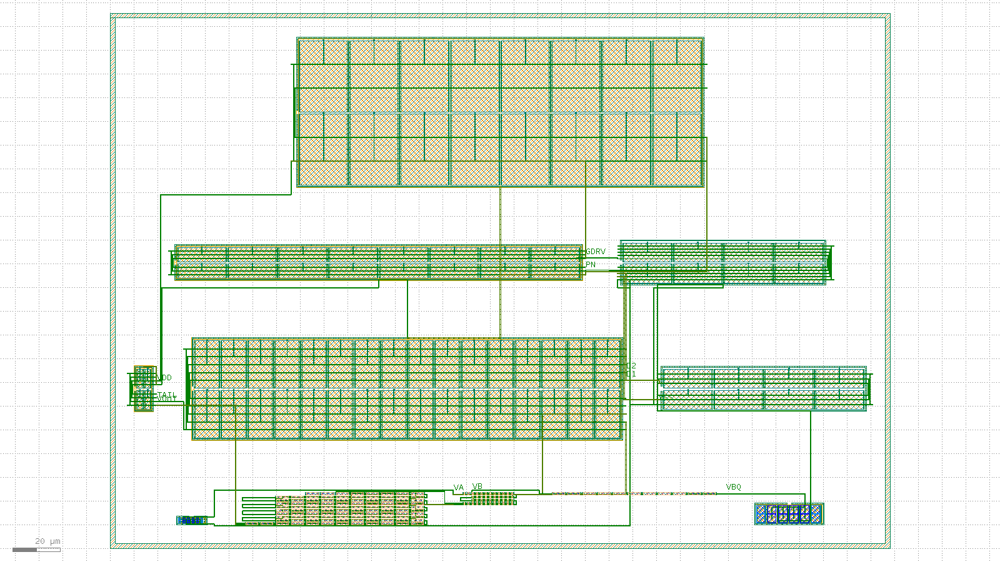

# Bandgap-core routed layout record: 20260811-221633-a0ee5e7

Routed-and-extracted successor to the issue #15 placement-only floorplan skeleton (`layout/bandgap-core/reports/` earlier records). Read `layout/matching-plan.md` for the matching rationale this layout implements; this record is the measured evidence, not the rationale.

## Acceptance-criteria scoreboard (issue #62)

| # | Criterion | Status | Evidence |
| --- | --- | --- | --- |
| 1 | Full inter-block routing | MET | 12/12 **schematic** inter-block nets fully drawn (13/13 declared met1 nets routed, 0 unrouted) -- see "Schematic inter-block nets" below |
| 2 | Resistor ladder at real unit count | MET | `res_r2` num=96 (= 2 legs x 48 coarse 5um units) + `res_trim` num=40 (= 2 legs x 20 fine 0.5um units) = 250 um/leg at DR-002 code 0, against design/bandgap_core.sch's `r_lseg*n_r2` = 250 um (delta +0 um); composed bbox 73,989 um^2 vs 50,000 um^2 budget |
| 3 | Extract: correct device classes + promoted pins | MET | device_counts={"nfet": 16, "pfet": 68, "pnp": 16, "res_high_po": 143}, pin_count=11 |
| 4 | `klt lvs` clean | MET | status=match, mismatch_count=0 |
| 5 | Blocking `klt` gaps filed as friction | MET | every gap this flow ever named as *blocking* is now CLOSED upstream and this record is the re-run against them: 2AMLogic/klayout-tools#461 via #474, #462 via #471, #463 via #475, #454 via #468, #470 via #481, #490 via #495, #491 via #494, #492 via #497/#498, #504 via #505, and -- turned on by the nineteenth increment -- **#508 via #511** (sky130's curated deck gains met2 as a third connectivity level, which is what makes criterion 1's escape plane real connectivity rather than inert geometry; see ROUTING_PLANE_NOTE / MET2_ESCAPE_NOTE). 2AMLogic/klayout-tools#506 (the generic arity reconciliation #505 deferred, filed by the fifteenth increment) has since closed as COMPLETED too -- this flow never needed it, because its own reference can state the bulk net directly. **Every gap this flow has ever filed as blocking is now closed upstream.** Two non-blocking gaps were filed by the nineteenth increment: **klayout-tools#513** is the flip side of #511 -- the curated sky130 **DRC** deck was not extended alongside the extraction deck, so `klt drc` returns violation_count=0 on any met2 geometry whatsoever, and this flow checks the plane itself instead (`layout/bin/met2_drc.py`, gated; see the met2 DRC row in Results). **klayout-tools#514** is the labelling gap INTERNAL_NODE_LABEL_NOTE describes: there is no way to name a net without promoting it to a pin, and a pin on a node interior to a schematic device silently blocks `combine_devices` with nothing attributing the resulting mismatches to it. The twenty-first increment filed no new gap (the PNP `ae`/`pe`/`ne` fix was a `reference.spice` transcription fix, needing no new `klt` capability). **This (twenty-third) increment picks up 2AMLogic/klayout-tools#518 via #519 and #521 via #526** (the `res_high_po` fixed head/end-resistance term, and the fix that makes it reach the written netlist `klt lvs` compares) and, having measured that picking them up does not close AC4's resistor cause, files one new non-blocking gap: **klayout-tools#559** -- `ResistorDevice.fixed_offset_ohm` is charged once per drawn primitive, not once per logical device, so `combine_devices` folding a caller's own multi-primitive series decomposition (this flow's trim-tap ladder) sums it once per primitive instead of once for the schematic-level device. **This (twenty-eighth) increment bumps the klt pin past #583 (which closed #559 by deferring that correction until after `combine_devices()` folds) and #587 (which made the deferral reachable from this flow's own pre-extracted request shape, closing #585/#586 -- the real blocker was a case-sensitive device-class lookup that missed the `NetlistSpiceReader`-uppercased `RES_HIGH_PO` name, NOT `layout.deck` being ignored on that shape: `layout_deck` resolves unconditionally in `run_lvs`).** The once-per-combined-device correction is therefore reachable now, and is measured with `layout/bin/measure_fixed_offset_variants.py` across all four accounting combinations (`layout/bandgap-core/fixed-offset-variants/<record-id>/`). It is **deliberately NOT adopted**, and at this repo's current state adopting it would be a measured REGRESSION rather than a neutral choice: since issue #108 settled `reference.spice` on the CHAINED value this flow's own multi-primitive decomposition sums to, the shipped per-primitive accounting is the only variant that matches at all -- #587's own defer-plus-deck pairing takes `mismatch_count` 1 -> 4 and `devices.matched` 15 -> 12. DR-003's ratified finding points the same way: this layout physically pays the head resistance once per separately-contacted instance, so re-reporting each leg at the single-device value would state a resistance the fabricated cell does not have. See RES_HEAD_RESISTANCE_NOTE, DR-003 and layout/matching-plan.md Section 7z |

- [x] DRC on the composed, routed layout is clean
- [ ] Composed bbox area (73,989 um^2) is within the < 0.05 mm^2 (50,000 um^2) budget, **at the real full-length ladder count** (96 coarse + 40 fine units)

## Flow

1. `klt gen` once per matched device group (11 blocks).
2. `klt draw` once, for the whole cell: every intra-block bus and every inter-block net, on met1 over mcon -- plus, for the hops met1 has no corridor for, a met2 escape over `via.drawing` (MET2_ESCAPE_NOTE) -- and one met1 net label per *schematic* node. `bandgap_core_bus.draw.json`, summarised in `bus-summary.json`.
3. `klt gen-compose` with `placement.strategy: "explicit"`, an empty `connectivity[]` (routing is drawn above) and an empty `pins[]` -- every pin this cell promotes is now a net label from step 2, and the four trim-tap pin entries earlier records carried are gone (INTERNAL_NODE_LABEL_NOTE). `compose.request.json`.
4. `klt drc <composed> --deck sky130`.
4b. `layout/bin/met2_drc.py <composed>` -- the escape plane's own DRC, because the curated deck step 4 runs is still missing the met2 min-area rule (`m2.6`; klayout-tools#513/#515 added the rest).
5. `klt extract <composed> --deck sky130 --top bandgap_core_routed`.
6. `klt lvs` against the xschem-derived reference netlist (issue #8), twice -- with and without `options.combine_devices`.
7. `klt render` for the visual check below.

## Device-half binding

A `klt gen diff_pair` reports its two transistors as two port families (`M1_*`/`M2_*`, or `Q1_*`/`Q2_*` when `mirror` is false). Which family is which schematic device is *this flow's* choice, not the generator's -- the halves are geometrically interchangeable. Until this increment that choice was never made: every net picked whichever candidate pad sat nearest its own centroid, independently. Two consequences were live in the previous record. `PN` took a finger of the same amp_pmirr half the `AOUT` label named, so MP3's drain and MP4's drain were the same physical transistor; and amp_nload's `D1` route and `D1_GATE` label disagreed about which half is MN1. Neither is visible to DRC or to the drawn-short check -- every terminal involved is legal, well-separated metal.

| block | port family | schematic device | drain pad | source pad |
| --- | --- | --- | --- | --- |
| `core_mirror` | `M1_*` | `MPOUT` | `M1_*_D` | `M1_*_S` |
| `core_mirror` | `M2_*` | `MPAMP` | `M2_*_D` | `M2_*_S` |
| `amp_input_pair` | `Q2_*` | `MP1` | `Q2_*_D` | `Q2_*_S` |
| `amp_input_pair` | `Q1_*` | `MP2` | `Q1_*_D` | `Q1_*_S` |
| `amp_nload` | `M1_*` | `MN1` | `M1_*_S` | `M1_*_D` |
| `amp_nload` | `M2_*` | `MN2` | `M2_*_S` | `M2_*_D` |
| `amp_pmirr` | `M1_*` | `MP3` | `M1_*_D` | `M1_*_S` |
| `amp_pmirr` | `M2_*` | `MP4` | `M2_*_D` | `M2_*_S` |
| `amp_nmirr` | `M1_*` | `MN4` | `M1_*_S` | `M1_*_D` |
| `amp_nmirr` | `M2_*` | `MN3` | `M2_*_S` | `M2_*_D` |
| `amp_cc` | `M1_*` | `MCC_A` | `M1_*_D` | `M1_*_S` |
| `amp_cc` | `M2_*` | `MCC_B` | `M2_*_D` | `M2_*_S` |

Every routed terminal and every gate pin label now resolves through that table (`mos_terminal()` / `bulk_terminal()`), so a node can only land on the transistor the schematic names.

## Blocks

| id | generator | matched group | real target |
| --- | --- | --- | --- |
| `pnp_ctat` | `bjt_array` | Q1 (CTAT PNP, small unit W0p68L0p68) | m=8 sky130_fd_pr__pnp_05v5_W0p68L0p68 (design/bandgap_core.sch); drawn 1:1 (8 real units, 2x4 common-centroid) |
| `res_r2` | `res_array` | R2A/R2B interdigitated ladder (K = R2/R1 divider) | 48 coarse 5um segments PER LEG x 2 legs = 96 total = 240 um/leg, the coarse part of design/bandgap_core.sch's 250 um (`r_lseg*n_r2` at n_r2=50); the remaining 10 um is `res_trim`'s fine ladder, so the trim taps subtract from the specified length instead of adding to it (issue #91). The skeleton's 16-unit reduction is closed by `res_array`'s `rows` fold parameter (2AMLogic/klayout-tools#415, merged via #418) |
| `res_trim` | `res_array` | Downward-only trim ladder taps (both legs) | 20 fine 0.5um units PER LEG x 2 legs = 40 unit taps, the fine part of the same 250 um leg -- code 0 puts all 20 in circuit and code -k skips k of them, so the ladder spans 0..-20 of which DR-002 certifies 0..-16 (design/bandgap_core.sch CORE_PARAMS, DR-002); drawn 1:1 |
| `res_r1` | `res_array` | R1 (dVBE-to-current leg) | n_r1=7 unit segments (design/bandgap_core.sch); drawn 1:1 |
| `pnp_ptat` | `bjt_array` | Q2 (PTAT PNP, large unit W3p40L3p40) | m=8 sky130_fd_pr__pnp_05v5_W3p40L3p40 (design/bandgap_core.sch); drawn 1:1 (8 real units, 2x4 common-centroid) |
| `core_mirror` | `diff_pair` | MPOUT/MPAMP (core PMOS output/bias mirror) | m_out=m_ampbias=2, W=8 L=2 (design/bandgap_core.sch); drawn 1:1 |
| `amp_input_pair` | `diff_pair` | MP1/MP2 (amp PMOS input pair) | amp_m_in=16, W=20 L=10 (design/error_amp.sch); drawn 1:1 -- the dominant mismatch contributor per layout/matching-plan.md Section 1 |
| `amp_nload` | `diff_pair` | MN1/MN2 (amp NMOS diode loads) | amp_m_nmirr=4, W=8 L=20 (design/error_amp.sch); drawn 1:1 |
| `amp_pmirr` | `diff_pair` | MP3/MP4 (amp PMOS mirror) | amp_m_pmirr=8, W=6 L=20 (design/error_amp.sch); drawn 1:1 |
| `amp_nmirr` | `diff_pair` | MN3/MN4 (amp NMOS mirror outputs) | amp_m_nmirr=4, W=8 L=20 (design/error_amp.sch); drawn 1:1 |
| `amp_cc` | `diff_pair` | MCC (amp Miller compensation cap, PMOS-as-capacitor) | amp_m_cc=16, W=30 L=20 (design/error_amp.sch); drawn as two mult=8 groups (`MCC_A`/`MCC_B`) tied identically to VDD (drain+source) and GDRV (gate) so `combine_devices` folds them into the schematic's single m=16 device -- see MCC_MIM_INFEASIBLE_NOTE for why a `cap_mim` overlay (the operator's primary-path ruling on issue #62) cannot close this device instead |

Note: MCC (amp compensation cap, amp_m_cc=16 x W=30 x L=20 = 9600 um^2 analytic) is now drawn, as of issue #62's thirtieth increment -- see the `amp_cc` block above and MCC_MIM_INFEASIBLE_NOTE for why it is a MOS-as-capacitor block rather than a cap_mim overlay. Drawing it pushes the composed cell over the ratified 50,000 um^2 (DR-005) Area budget; see spec/decision-records/DR-007-mcc-area-budget.md (proposed, not ratified) and this record's own `within_budget` gate result

## Intra-block busses drawn on met1

Each matched group's units are tied into the node the schematic says they form, on met1 over mcon -- the sky130 extraction deck's own second conductor and via (`metals = (li1, met1, met2)`, `vias = (mcon, via)` since klayout-tools#511; met2 is reserved for the inter-block escape plane above and no intra-block bus uses it). This flow draws them itself from each block's reported `ports[]` (MET1_BUS_NOTE). That is what turns a 100-segment coarse ladder (and its 40-segment fine trim ladder) into two real series resistors, an 8-unit PNP array into one real m=8 device, and -- new in this increment -- each split MOS group's 4 to 32 fingers into the single m=N transistor the schematic names.

| block | bus | detail |
| --- | --- | --- |
| `pnp_ctat` | parallel unit bus | `VA` = 8 pads on 4 columns; `VSS` = 8 pads on 4 columns |
| `res_r2` | 2 interdigitated series string(s) | 94 unit-to-unit met1 links |
| `res_trim` | 2 interdigitated series string(s) | 38 unit-to-unit met1 links |
| `res_r1` | 1 interdigitated series string(s) | 6 unit-to-unit met1 links |
| `pnp_ptat` | parallel unit bus | `VBQ` = 8 pads on 4 columns; `VSS` = 8 pads on 4 columns |
| `core_mirror` | split-device finger bus | `VDD` = 4 finger pads joined on the W spine; `GDRV` = 4 finger pads (4 gate contacts) joined on the W spine; `TAIL` = 2 finger pads joined on the W spine; `VOUT` = 2 finger pads joined on the W spine |
| `amp_input_pair` | split-device finger bus | `D1` = 16 finger pads joined on the W spine; `D2` = 16 finger pads joined on the W spine; `VB` = 16 finger pads (16 gate contacts) joined on the W spine; `VA` = 16 finger pads (16 gate contacts) joined on the W spine; `TAIL` = 32 finger pads joined on the W spine |
| `amp_nload` | split-device finger bus | `D1` = 8 finger pads (4 gate contacts) joined on the E spine; `D2` = 8 finger pads (4 gate contacts) joined on the E spine; `VSS` = 8 finger pads joined on the E spine |
| `amp_pmirr` | split-device finger bus | `GDRV` = 8 finger pads joined on the W spine; `PN` = 24 finger pads (16 gate contacts) joined on the W spine; `VDD` = 16 finger pads joined on the W spine |
| `amp_nmirr` | split-device finger bus | `GDRV` = 4 finger pads joined on the E spine; `PN` = 4 finger pads joined on the E spine; `D1` = 4 finger pads (4 gate contacts) joined on the E spine; `D2` = 4 finger pads (4 gate contacts) joined on the E spine; `VSS` = 8 finger pads joined on the E spine |
| `amp_cc` | split-device finger bus | `VDD` = 32 finger pads joined on the W spine; `GDRV` = 16 finger pads (16 gate contacts) joined on the W spine |

Drawn-short / spacing proof: every met1 rectangle carries the electrical node it belongs to, and **0** pairs of rectangles belonging to *different* nodes come within the deck's 0.14 um `met1.space.1` clearance. The flow fails on any nonzero count -- a drawn short the DRC deck happens not to model would otherwise read as connectivity.

Split-node proof (the inverse check): every node's own met1 is counted into connected components, and **0** of the nodes this router reports as fully routed are drawn in more than one piece. The flow fails on any nonzero count. A node drawn as two islands that never touch is not a connected node, and unlike a drawn short *nothing downstream reports it*: DRC sees two legal wires, `klt extract` sees two anonymous nets with nothing in `warnings[]`, and the coverage table below scores this flow's own hop bookkeeping rather than the geometry, so it would still call the node drawn. Nodes that came up a hop short are excluded on purpose -- they are *supposed* to be in more than one piece, and the coverage table already says so. Their piece counts, and every other node's, are in `bus-summary.json`'s `_components` (every node is a single piece).

Label-collision proof: **0** extracted net(s) carry more than one label. This is the pad-side counterpart of the check above and is gated the same way. A `pins[]` entry labels a *port*, i.e. a pad, so a label placed on a pad another node's metal already contacts does not name its own node -- it renames that node, and `klt extract` emits the result as a single net called `A|B` with nothing in `warnings[]` and DRC still clean. The previous increment's composed layout shipped exactly that: `VOUT`'s label sat on `core_mirror.M2_1_D`, which is MPAMP's drain and the pad the drawn `TAIL` net contacts, so its extracted netlist contained a net named `TAIL|VOUT` -- the layout asserting that the reference output and the amp tail are one node. The pin selector and the router now share one claimed-pad set, and this line is the proof. Filed upstream as 2AMLogic/klayout-tools#470 (the silence, not the collision, is the tool gap).

## Inter-block nets drawn on met1

| net | terminals | routed | plane | schematic node |
| --- | --- | --- | --- | --- |
| `VSS` | `pnp_ctat:VSS trunk` + `amp_nmirr:VSS:far0` + `amp_nload:VSS:far0` + `amp_nmirr.TAP_S` + `amp_nload.TAP_S` + `pnp_ptat:VSS trunk` | yes | met1 | VSS trunk: every finger of all four amp NMOS sources (MN1-MN4), both NMOS groups' substrate guard-ring taps, and both PNP base ties (the diode-connected PNPs' base sits on VSS) |
| `TAIL` | `core_mirror:TAIL:far0` + `amp_input_pair:TAIL:spine0` | yes | met1 | MPAMP drain to the amp input pair's common source |
| `GDRV` | `core_mirror:GDRV:far1` + `amp_cc:GDRV:spine0` + `amp_pmirr:GDRV:far1` + `amp_nmirr:GDRV:far1` | yes | met1 + met2 x1 | the amp's output -- MP4's and MN3's drains -- the core mirror's gate drive, and MCC's gate (the compensation cap sits from AOUT/GDRV to VDD), one node in the schematic and now one drawn node in the layout |
| `D1` | `amp_nmirr:D1:far0` + `amp_input_pair:D1:far1` + `amp_nload:D1:far1` | yes | met1 + met2 x2 | MP1's drain, MN1's diode-connected drain/gate, and MN3's gate |
| `D2` | `amp_nmirr:D2:far0` + `amp_input_pair:D2:far1` + `amp_nload:D2:far0` | yes | met1 + met2 x2 | MP2's drain, MN2's diode-connected drain/gate, and MN4's gate |
| `PN` | `amp_pmirr:PN:far0` + `amp_nmirr:PN:far0` | yes | met1 | MN4's drain, MP3's diode-connected drain/gate, and MP4's gate |
| `VA` | `pnp_ctat:VA trunk` + `res_trim.R38_B` + `amp_input_pair:VA:far0` | yes | met1 + met2 x1 | the R2A leg's low end (at trim code 0, the far end of its fine ladder) to Q1's emitter bus and MP2's gate -- the amp's VINN node |
| `TRIM_A` | `res_r2.R94_B` + `res_trim.R0_A` | yes | met1 + met2 x1 | R2A's coarse 240 um into leg A of the fine trim ladder that carries the leg's last 10 um (DR-002, downward-only) |
| `VOUT` | `core_mirror:VOUT:far0` + `res_r2.R0_A` + `res_r2.R1_A` | yes | met1 + met2 x1 | MPOUT's drain and the high ends of both divider legs -- the reference output |
| `TRIM_B` | `res_r2.R95_B` + `res_trim.R1_A` | yes | met1 | R2B's coarse 240 um into leg B of the same fine ladder |
| `VB` | `res_trim.R39_B` + `res_r1.R0_A` + `amp_input_pair:VB:far0` | yes | met1 + met2 x1 | the R2B leg's low end (at trim code 0, the far end of its fine ladder) to R1's head and MP1's gate -- the amp's VINP node |
| `VBQ` | `res_r1.R6_B` + `pnp_ptat:VBQ trunk` | yes | met1 | R1's tail to Q2's emitter bus |
| `VDD` | `core_mirror.TAP_N` + `core_mirror:VDD:far1` + `amp_pmirr.TAP_S` + `amp_input_pair.TAP_N` + `amp_cc.TAP_S` + `amp_pmirr:VDD:far0` + `amp_cc:VDD:far0` | yes | met1 + met2 x4 | VDD trunk: MPOUT/MPAMP and MP3/MP4 sources, MCC's drain+source (it is wired D=S=B=VDD, a MOS capacitor) -- every finger of all five, not one pad per block -- plus each PMOS group's n-well guard-ring tap (the reference's pfet bulk terminal) |

### The met2 escape plane

**13** of this cell's inter-block hops are drawn on met2 rather than met1, each entered and left through a via1 stack (met1 pad + `via.drawing` cut + met2 pad). met1 on this floorplan carries both every block's intra-block bus and every inter-block net, and the hops below had no met1 corridor at any lane, margin, block placement or search depth this repo can set -- layout/matching-plan.md Sections 7d-7o are the exhausted list. met2 is a genuinely independent conductor, and became one for sky130's curated deck only with 2AMLogic/klayout-tools#508 (merged via #511); before that its `metal2` role resolved to the same met1 layer this flow's own bussing already occupies. The escape is tried **strictly last**, after every met1 elbow, channel path and Z-detour has been drawn and rolled back, so met1 remains the primary plane -- see MET2_ESCAPE_NOTE.

| net | hop | via1 drops (um) | met2 path |
| --- | --- | --- | --- |
| `GDRV` | `amp_cc:GDRV:spine0` -> `amp_pmirr:GDRV:far1` | (66.07, 153.13) -> (189.93, 112.22) | 3-point |
| `D1` | `amp_nmirr:D1:far0` -> `amp_input_pair:D1:far1` | (203.53, 105.9) -> (207.0, 60.823) | 3-point |
| `D1` | `amp_input_pair:D1:far1` -> `amp_nload:D1:far1` | (207.0, 60.823) -> (221.0, 59.49) | 3-point |
| `D2` | `amp_nmirr:D2:far0` -> `amp_input_pair:D2:far1` | (203.53, 104.567) -> (206.2, 64.157) | 3-point |
| `D2` | `amp_input_pair:D2:far1` -> `amp_nload:D2:far0` | (206.2, 64.157) -> (221.0, 52.67) | 3-point |
| `VA` | `res_trim.R38_B` -> `amp_input_pair:VA:far0` | (134.32, 12.85) -> (207.0, 43.337) | 3-point |
| `TRIM_A` | `res_r2.R94_B` -> `res_trim.R0_A` | (91.33, 12.85) -> (134.32, 8.65) | 3-point |
| `VOUT` | `core_mirror:VOUT:far0` -> `res_r2.R0_A` | (9.42, 50.27) -> (42.74, 0.25) | 3-point |
| `VB` | `res_r1.R0_A` -> `amp_input_pair:VB:far0` | (171.9, 13.9) -> (207.0, 46.67) | 3-point |
| `VDD` | `core_mirror.TAP_N` -> `core_mirror:VDD:far1` | (4.11, 66.62) -> (9.42, 59.09) | 3-point |
| `VDD` | `amp_input_pair.TAP_N` -> `amp_cc.TAP_S` | (115.01, 78.62) -> (154.1, 142.42) | 3-point |
| `VDD` | `amp_cc.TAP_S` -> `amp_pmirr:VDD:far0` | (154.1, 142.42) -> (189.93, 105.4) | 3-point |
| `VDD` | `amp_pmirr:VDD:far0` -> `amp_cc:VDD:far0` | (189.93, 105.4) -> (241.13, 163.13) | 4-point |

**`klt drc` now checks most of this geometry.** klayout-tools#513 (merged via #515) added met2/via1 width, spacing and enclosure rules to the curated sky130 deck, and `drc.json`'s own `coverage` block (klayout-tools#189) confirms neither escape-plane layer (`via.drawing` 68/44, `met2.drawing` 69/20) is in this run's unchecked-layer list (`64/20, 65/44, 66/13, 68/5, 82/44, 83/20, 86/20, 94/20`). What `klt drc` still cannot check is the met2 min-area rule (`m2.6`) -- #515 left it out because the curated deck's rule vocabulary has no `area` check primitive. `layout/bin/met2_drc.py` re-checks the full sky130A source-deck threshold set (including `m2.6`) independently and gates on it -- see the met2 DRC row in Results and [`met2-drc.json`](met2-drc.json).

## Schematic inter-block nets: drawn vs. labelled only

The table above counts this flow's own routing declaration. This one counts what issue #62 actually asks for: every node of design/bandgap_core.sch (+ design/error_amp.sch) that joins devices in different blocks, and whether drawn metal joins **all** the blocks the schematic says it reaches. Every one of these nodes is *expressible*: MOS gates are contactable (MOS_GATE_NOTE), the resistor blocks carry the schematic's own flavour (RES_FLAVOR_NOTE), and -- new in this increment -- a hop that met1 has no corridor for can escape onto met2 (MET2_ESCAPE_NOTE). A row that is not `drawn` would therefore be this flow's own router failing on a floorplan that can express the node, not a capability being waited on.

| schematic net | reaches (blocks) | joined by drawn metal | not drawn | status |
| --- | --- | --- | --- | --- |
| `VA` | `pnp_ctat`, `res_trim`, `amp_input_pair` | `amp_input_pair`, `pnp_ctat`, `res_trim` | -- | **drawn** |
| `VB` | `res_trim`, `res_r1`, `amp_input_pair` | `amp_input_pair`, `res_r1`, `res_trim` | -- | **drawn** |
| `TRIM` | `res_r2`, `res_trim` | `res_r2`, `res_trim` | -- | **drawn** |
| `VBQ` | `res_r1`, `pnp_ptat` | `pnp_ptat`, `res_r1` | -- | **drawn** |
| `VOUT` | `core_mirror`, `res_r2` | `core_mirror`, `res_r2` | -- | **drawn** |
| `GDRV` | `core_mirror`, `amp_pmirr`, `amp_nmirr`, `amp_cc` | `amp_cc`, `amp_nmirr`, `amp_pmirr`, `core_mirror` | -- | **drawn** |
| `TAIL` | `core_mirror`, `amp_input_pair` | `amp_input_pair`, `core_mirror` | -- | **drawn** |
| `D1` | `amp_input_pair`, `amp_nload`, `amp_nmirr` | `amp_input_pair`, `amp_nload`, `amp_nmirr` | -- | **drawn** |
| `D2` | `amp_input_pair`, `amp_nload`, `amp_nmirr` | `amp_input_pair`, `amp_nload`, `amp_nmirr` | -- | **drawn** |
| `PN` | `amp_nmirr`, `amp_pmirr` | `amp_nmirr`, `amp_pmirr` | -- | **drawn** |
| `VDD` | `core_mirror`, `amp_input_pair`, `amp_pmirr`, `amp_cc` | `amp_cc`, `amp_input_pair`, `amp_pmirr`, `core_mirror` | -- | **drawn** |
| `VSS` | `amp_nload`, `amp_nmirr`, `pnp_ctat`, `pnp_ptat` | `amp_nload`, `amp_nmirr`, `pnp_ctat`, `pnp_ptat` | -- | **drawn** |

**12 of 12 schematic inter-block nets are fully drawn.** Criterion 1 is scored PARTIAL, not MET, whenever that count is short -- it is not short here. `VSS` reaches four blocks here, not the seven an earlier record listed: the three resistor blocks' `res_high_po` bulk terminals are on this node in the schematic and now resolve to the same real, drawn `VSS` net the rest of the row does (SUBSTRATE_NET_NOTE) -- but `res_array` draws no bulk-terminal pad inside those three blocks, so there is nothing for this router to target and counting them as routing targets would be scoring against an impossible bar rather than a missed one.

## Promoted top-level pins

`klt gen-compose` labelled 0/0 requested `pins[]` ports; `klt extract` promoted **11** top-level pins (the #15 skeleton promoted `pin_count: 0`).

| net | port | labelled |
| --- | --- | --- |

Four labels the previous records carried are **gone** from this list, and their absence is one of this increment's two substantive changes: `TRIM_A`, `TRIM_B`, `TRIM_A_CODE_0` and `TRIM_B_CODE_0`. A labelled met1 net is promoted by `klt extract` to a **top-level pin**, and `klt lvs`'s `combine_devices` will not fold a series chain through a pinned node -- folding one away would delete an externally visible port. This flow labelled every declared inter-block net plus four trim taps, including `TRIM_A`/`TRIM_B` (the junction between `res_r2`'s leg and `res_trim`'s leg) and `TRIM_A_CODE_0`/`TRIM_B_CODE_0`. Every one of those four sits on a node *interior to the schematic's own R2A/R2B device*, which at DR-002's code 0 the schematic does not have at all -- so each leg's series chain was pinned into three pieces on the layout side and none of the three could pair with the reference's single R2A/R2B, and the resulting orphan nodes dragged `VBQ`, `R1` and `Q2` out of correspondence with them. Measured in isolation before being fixed: re-running `klt lvs` on the identical extracted netlist with only those four pins removed took `mismatch_count` 26 -> 18 and `device.unmatched` 13 -> **1** (the deliberately-undrawn `MCC`), with `net.unmatched` going 6 -> 0. Fixed here by not labelling a net declared `internal` to a schematic device, and by reporting the trim taps into the record instead of into `pins[]` -- the taps are still documented, they are just no longer asserted to be device-level ports of this cell.

### DR-002 trim-ladder taps (documented, not pinned)

Every code the drawn metal option can select, with the divider-leg length it yields. Each tap is located and validated against the block's own reported ports every run -- a count-constant change fails the flow loudly here rather than silently mislabelling a tap -- and the lengths below are computed from the tap index, not asserted, so the table *is* the demonstration that the ladder runs downward: code -k yields exactly `spec - k` um. Taps are reported into this record instead of into `pins[]` for the reason above.

Codes outside DR-002's certified 0..-16 range are drawn (the ladder is a metal option, so its physical taps exist whether or not a code is certified) and are marked **out-of-certified-range** below. `spec/decision-records/DR-002-trim-network-scoping.md` certifies the operating point over 0..-16 only; issue #46 and `sim/trim-range-monotonicity/` are the corner evidence for the boundary. Selecting one of the flagged taps is out of spec, not a wider trim range.

| DR-002 code | leg A port | leg B port | leg length | certified |
| --- | --- | --- | --- | --- |
| `0` | res_trim.R38_B | res_trim.R39_B | 250 um | yes |
| `-1` | res_trim.R36_B | res_trim.R37_B | 250 um | yes |
| `-2` | res_trim.R34_B | res_trim.R35_B | 249 um | yes |
| `-3` | res_trim.R32_B | res_trim.R33_B | 248 um | yes |
| `-4` | res_trim.R30_B | res_trim.R31_B | 248 um | yes |
| `-5` | res_trim.R28_B | res_trim.R29_B | 248 um | yes |
| `-6` | res_trim.R26_B | res_trim.R27_B | 247 um | yes |
| `-7` | res_trim.R24_B | res_trim.R25_B | 246 um | yes |
| `-8` | res_trim.R22_B | res_trim.R23_B | 246 um | yes |
| `-9` | res_trim.R20_B | res_trim.R21_B | 246 um | yes |
| `-10` | res_trim.R18_B | res_trim.R19_B | 245 um | yes |
| `-11` | res_trim.R16_B | res_trim.R17_B | 244 um | yes |
| `-12` | res_trim.R14_B | res_trim.R15_B | 244 um | yes |
| `-13` | res_trim.R12_B | res_trim.R13_B | 244 um | yes |
| `-14` | res_trim.R10_B | res_trim.R11_B | 243 um | yes |
| `-15` | res_trim.R8_B | res_trim.R9_B | 242 um | yes |
| `-16` | res_trim.R6_B | res_trim.R7_B | 242 um | yes |
| `-17` | res_trim.R4_B | res_trim.R5_B | 242 um | **no -- out of certified range** |
| `-18` | res_trim.R2_B | res_trim.R3_B | 241 um | **no -- out of certified range** |
| `-19` | res_trim.R0_B | res_trim.R1_B | 240 um | **no -- out of certified range** |
| `-20` | res_trim.R0_A | res_trim.R1_A | 240 um | **no -- out of certified range** |

### Drawn vs. specified R2 leg length

The divider legs are the one place where the layout's own geometry constants can disagree with design/bandgap_core.sch's `CORE_PARAMS` without anything else in this flow noticing -- `klt lvs` can only report a resistor's *value*, and only once the two sides pair at all, which they did not until the nineteenth increment. This row states the comparison in the units the schematic itself specifies, unconditionally, from this flow's own constants. **It is a gated condition** (`r2_leg_length_matches`), not merely a reported one, since issue #91.

| quantity | value |
| --- | --- |
| `res_r2` coarse leg (drawn) | 240 um (48 x 5 um) |
| `res_trim` fine leg at code 0 (drawn) | 10 um (20 x 0.5 um) |
| **total drawn** | **250 um** |
| schematic `L = r_lseg*n_r2 + r_lseg_trim*n_r2_trim` | 250 um |
| delta | +0 um |
| effective DR-002 trim code | **+0** |

**How this came to be a gated row.** With INTERNAL_NODE_LABEL_NOTE's pins removed the comparer paired R2A and R2B and reported a *value* difference -- the first time this flow had been able to see one on these devices: layout 91,462.8 ohm against the reference's 88,130 ohm. 91,462.8 / 319.8 ohm-per-square = **286 squares**, i.e. a 286 um drawn leg where design/bandgap_core.sch's `L = r_lseg*n_r2 + r_lseg_trim*n_r2_trim` at `n_r2=54, r_lseg=5, n_r2_trim=0` states 270 um. The 16 um was exactly `res_trim`'s 16 x 1 um leg, which the layout wired in series *after* a full-length 270 um `res_r2` leg: the drawn cell sat at trim code **+16**, and DR-002 rejects every positive code outright (issue #46 found n_r2=55, i.e. +5 um, already collapses the operating point at the ff/2.97 V and fs/2.97 V hot corners; sim/trim-range-monotonicity/ finds +1/+2 collapse too). Worse than the 5.9% value error: with the ladder wired after the full leg, *every* tap moved the leg further up from 270, so the drawn ladder could not express any of the 16 downward codes DR-002 certifies. A real layout-vs-schematic defect, not an LVS bookkeeping artifact. **Fixed in issue #91** by re-decomposing the leg instead of extending it: `res_r2` draws 50 coarse 5 um units (250 um) and `res_trim` the remaining 20 fine 1 um units (20 um), so the code-0 tap -- the far end of the fine chain, which is what `VA`/`VB` join -- is exactly 270 um and code -k skips k fine units for 270-k um. 50/20 is the minimal integral decomposition that keeps 270 um and still reaches DR-002's -16 (51 coarse + 15 fine also totals 270 but stops at -15). The drawn ladder spans 0..-20; -17..-20 are physically drawn but flagged out-of-certified-range in the tap table above, not offered as valid codes. `r2_leg_length()` now reports `matches: true` and is a **gated** flow condition (`r2_leg_length_matches`) rather than a recorded number, so this cannot silently regress. See layout/matching-plan.md Section 7r.

## Results

| Stage | Status | Detail |
| --- | --- | --- |
| met1 routing | routed | nets=13, unrouted=0, drawn-short conflicts=0, split routed nodes=0 |
| DRC | clean | violation_count=0 |
| met2 DRC (this repo's own) | clean | violation_count=0, via1 cuts=22, met2 polygons=9 |
| extract | ok | device_count=243, device_counts={"nfet": 16, "pfet": 68, "pnp": 16, "res_high_po": 143}, pin_count=11 |
| LVS | match | mismatch_count=0 |

### Extracted device classes vs. the #15 skeleton

| class | this record | #15 skeleton |
| --- | --- | --- |
| `pnp` | 16 | 0 |
| `nfet` | 16 | 0 |
| `pfet` | 68 | 68 |
| `res_high_po` | 143 | 67 (as `res_generic_po`) |
| promoted pins | 11 | 0 |

### LVS mismatch analysis

| run | `combine_devices` | status | mismatches |
| --- | --- | --- | --- |
| combined | True | match | 0 |
| uncombined | False | mismatch | 421 |

| | layout | reference | matched |
| --- | --- | --- | --- |
| nets | 11 | 11 | 11 |
| devices | 16 | 16 | 16 |
| pins | 11 | 4 | 11 |

Device counts here are **after** `klt lvs`'s `options.combine_devices` has folded both sides (this increment turns it on): the layout's series ladder segments and parallel array units collapse into the lumped devices the schematic states, which is only possible because the busses above are actually drawn. `klt extract` saw 243 drawn devices; the comparison sees 16.

Mismatch categories: `{}`.

The residual gap has exactly **one** disclosed cause left, as of this (issue #108) increment, and it is neither a topology error in either netlist, a connectivity difference, nor a layout defect: the single deliberately-undrawn device. Seven causes tracked by prior records -- the deck-synthesized substrate net, undeclarable array dummies, the resistor device-class arity mismatch, unrouted schematic nodes, the R2 divider leg length, the PNP `ae`/`pe`/`ne` transcription gap, and (as of this increment) the `res_high_po` per-instance head-resistance value gap -- are **retired**; see "Retired since the last increment" below.

1. **`MMCC`, the amp's compensation cap, is in the reference but deliberately not drawn in this layout** (see the Blocks note above), so one reference device has no layout counterpart by construction. This is the *only* mismatch on either side.

Not worked around by editing either netlist to match the other. `reference.spice` states design/bandgap_core.sch; rewriting it to enumerate the layout's own shortfalls would make LVS compare the layout against itself, which is not evidence. `MMCC` is a deliberate scope choice (a single-ended compensation cap this layout does not draw), not a defect either side could fix.

### Retired since the last increment

- **The R2 divider legs draw the length the schematic specifies.** With INTERNAL_NODE_LABEL_NOTE's pins removed the comparer paired R2A and R2B and reported a *value* difference -- the first time this flow had been able to see one on these devices: layout 91,462.8 ohm against the reference's 88,130 ohm. 91,462.8 / 319.8 ohm-per-square = **286 squares**, i.e. a 286 um drawn leg where design/bandgap_core.sch's `L = r_lseg*n_r2 + r_lseg_trim*n_r2_trim` at `n_r2=54, r_lseg=5, n_r2_trim=0` states 270 um. The 16 um was exactly `res_trim`'s 16 x 1 um leg, which the layout wired in series *after* a full-length 270 um `res_r2` leg: the drawn cell sat at trim code **+16**, and DR-002 rejects every positive code outright (issue #46 found n_r2=55, i.e. +5 um, already collapses the operating point at the ff/2.97 V and fs/2.97 V hot corners; sim/trim-range-monotonicity/ finds +1/+2 collapse too). Worse than the 5.9% value error: with the ladder wired after the full leg, *every* tap moved the leg further up from 270, so the drawn ladder could not express any of the 16 downward codes DR-002 certifies. A real layout-vs-schematic defect, not an LVS bookkeeping artifact. **Fixed in issue #91** by re-decomposing the leg instead of extending it: `res_r2` draws 50 coarse 5 um units (250 um) and `res_trim` the remaining 20 fine 1 um units (20 um), so the code-0 tap -- the far end of the fine chain, which is what `VA`/`VB` join -- is exactly 270 um and code -k skips k fine units for 270-k um. 50/20 is the minimal integral decomposition that keeps 270 um and still reaches DR-002's -16 (51 coarse + 15 fine also totals 270 but stops at -15). The drawn ladder spans 0..-20; -17..-20 are physically drawn but flagged out-of-certified-range in the tap table above, not offered as valid codes. `r2_leg_length()` now reports `matches: true` and is a **gated** flow condition (`r2_leg_length_matches`) rather than a recorded number, so this cannot silently regress. See layout/matching-plan.md Section 7r.
- **Every schematic inter-block node is now joined across every block it reaches.** Through the seventeenth increment, `D1`/`GDRV`/`VSS` were split in the layout where the reference has one node, and PRs #75-#88 are an exhaustive negative-result sequence on every met1-side lever (search depth, channel-search window, row-0 margin, row-0 re-placement, a genuine 2D row split, and klayout-tools#454/#468's `metal2` role). The cause was never any of those: it was that sky130's curated deck had only one routing plane above the device pads, and this flow's own bussing already occupied it. Retired by 2AMLogic/klayout-tools#508 (merged via #511) plus the escape router built on it -- see "The met2 escape plane" above. `net.split` and `net.merged` are both **0** in the categories line above; they were 10 and 3.
- **The trim ladder's nodes no longer split R2A/R2B into unpairable pieces.** A labelled met1 net is promoted by `klt extract` to a **top-level pin**, and `klt lvs`'s `combine_devices` will not fold a series chain through a pinned node -- folding one away would delete an externally visible port. This flow labelled every declared inter-block net plus four trim taps, including `TRIM_A`/`TRIM_B` (the junction between `res_r2`'s leg and `res_trim`'s leg) and `TRIM_A_CODE_0`/`TRIM_B_CODE_0`. Every one of those four sits on a node *interior to the schematic's own R2A/R2B device*, which at DR-002's code 0 the schematic does not have at all -- so each leg's series chain was pinned into three pieces on the layout side and none of the three could pair with the reference's single R2A/R2B, and the resulting orphan nodes dragged `VBQ`, `R1` and `Q2` out of correspondence with them. Measured in isolation before being fixed: re-running `klt lvs` on the identical extracted netlist with only those four pins removed took `mismatch_count` 26 -> 18 and `device.unmatched` 13 -> **1** (the deliberately-undrawn `MCC`), with `net.unmatched` going 6 -> 0. Fixed here by not labelling a net declared `internal` to a schematic device, and by reporting the trim taps into the record instead of into `pins[]` -- the taps are still documented, they are just no longer asserted to be device-level ports of this cell.
- **The substrate net is now real, drawn connectivity, not a declaration.** Through issue #62's thirteenth increment, sky130's curated extraction deck had no NMOS-body or resistor-bulk layer to derive from drawn geometry and tied every such terminal to a synthesized, undrawable `vsubs` global (2AMLogic/klayout-tools#490). Resolved via #495 (picked up this flow's fourteenth increment): a real drawn substrate tap -- which this layout already draws, wired to `VSS` -- now resolves the whole design's substrate identity to the real `VSS` net directly. Verified by reading the extracted netlist: every nfet body and every `res_high_po` bulk terminal reads `VSS`, not `vsubs`. No `hints.same_nets` entry is sent (`SUBSTRATE_SAME_NETS` is empty); the correspondence this flow previously had to *state* is now something `klt lvs` *discovers* from the drawn geometry on its own.
- **Array dummies are now correctly excluded from the comparison.** Through issue #62's thirteenth increment: 2AMLogic/klayout-tools#462 (merged via #471) extended `klt extract`'s dummy-device suppression from MOS gates to resistors and bipolars, which was only the extractor half of the gap. The other half was open on sky130: the suppression keyed off `ExtractionDeck.dummy`, and the sky130 curated deck declared no `dummy` layer at all, no `klt gen` generator drew one, and `klt extract` exposed no override -- so there was no layer for a layout to mark its dummies with, and every matched array's dummy edge units extracted as ordinary devices with no schematic counterpart. Resolved via 2AMLogic/klayout-tools#491 (merged via #494, picked up in this flow's fourteenth increment): sky130's curated deck now declares a `dummy` marker layer, and `mos_array`/`res_array`/ `bjt_array` draw it over each array's own `dummy_cells` footprint, so `klt extract` correctly drops them. Verified: `extract.json`'s `dummy_devices_dropped` is non-zero and `pnp`/`res_high_po` device counts dropped accordingly, with no change to the drawn GDS geometry -- a dummy unit has no schematic counterpart by construction (it exists only for layout-matching symmetry), so this is a strictly *more* correct comparison, not a number chased by hiding matching geometry.
- **The resistor device-class arity mismatch is fixed, not just diagnosed.** The sky130 deck marks `res_high_po` `bulk_to_substrate`, so `klt extract` writes a **three-node** R card (`R<name> <a> <b> <bulk> <value> <model>`), which KLayout's SPICE reader turns into `DeviceClassResistorWithBulk` (terminals A/B/W). Through issue #62's fifteenth increment, `reference.spice` carried only a **two-node** R card (`R<name> <a> <b> <value> <model>`), which the same reader turns into the incompatible `DeviceClassResistor` (terminals A/B) -- same model name on both sides, different terminal count, so `NetlistComparer` could not pair them regardless of value. 2AMLogic/klayout-tools#505 (merged) added a dedicated `device.class_arity` mismatch category for exactly this shape, diagnostic only -- it does not itself make the two classes match, and the generic reconciliation #504 proposed (a request-side hint normalizing the reference class's implicit bulk terminal, or the symmetric layout-side drop) was left unimplemented, filed by the fifteenth increment as 2AMLogic/klayout-tools#506, since closed as COMPLETED (`reference.device_bulk` now exists upstream). **Fixed in the sixteenth increment, without needing #506**: `reference.spice`'s `R2A`/`R2B`/`R1` cards now carry the bulk node too (`VSS`), because design/bandgap_core.sch's own schematic wires it there on every one of them (`r2ab`/`r2bb`/`r1b` lab_pins) and the checked-in xschem netlist `reference.spice` already cites as its source states it directly (`XR2A VA VOUT VSS sky130_fd_pr__res_high_po ...`) -- this was a transcription gap in `reference.spice`, not an invented connection, so fixing it is not the reference-edit-to-accommodate-the-layout this flow refuses elsewhere. That distinction is the whole reason #506 was not needed here and is still a valid ask elsewhere: #506 asks `klt` to reconcile the arity when the reference genuinely does *not* wire the bulk net and so cannot state it; this reference always could, and the fifteenth increment's premise that a reference edit was the only other option and one this flow refuses was wrong for this device only. Verified directly with `klayout.db.NetlistSpiceReader`: `reference.spice` now registers `RES_HIGH_PO` as `DeviceClassResistorWithBulk`, the same class the layout side registers. Confirmed to change nothing else: rerunning the full flow after the fix reproduces byte-identical `mismatch_count`, `category_counts`, and the identical `device.unmatched` entry list -- the arity mismatch was real and is now retired, but was never the operative blocker for these three devices; RES_TRIM_TOPOLOGY_NOTE's structural gap is. See layout/matching-plan.md Section 7n.
- **The PNP `ae`/`pe`/`ne` transcription gap is fixed.** `klt lvs`'s SPICE reader recognises `AE`/`PE`/`AB`/`PB`/`AC`/`PC`/`NE` on a `Q` card (KLayout's `DeviceClassBJT3Transistor` parameter set) but has no notion of a `M`/`mult` field for that class at all -- unlike `DeviceClassMOS3Transistor`, where a bare `m=` folds directly into `W` at read time (confirmed directly with `klayout.db.NetlistSpiceReader`), a Q-card's `m=8` is silently dropped and every unstated parameter defaults to its class default (`AE`/`PE`/`AB`/`PB`/`AC`/`PC` = 0, `NE` = 1). That is exactly the shape `klt lvs` reported before this fix: `ne` 8 (layout) vs 1 (reference), plus zero-valued `ae`/`pe`/`ab`/`pb`/`ac`/`pc`. `AE`/`PE` are knowable independent of this repo's own layout generator: the instantiated model name IS the vendor's geometry declaration. `sky130_fd_pr__pnp_05v5_W0p68L0p68`/`_W3p40L3p40` are SkyWater's own fixed, non-parametric macro cells -- `sky130_fd_pr/pnp_05v5.sym`'s netlist format is `... sky130_fd_pr__@model m=@m`, with no W/L/area argument at all, and the corresponding `.subckt`s in libs.ref/sky130_fd_pr/spice/sky130_fd_pr__pnp_05v5_W*.model.spice take only `Collector Base Emitter` plus a `mult` param; every geometry-dependent SPICE parameter (`is`/`bf`/...) is baked into that specific model's own cards. The vendor's own naming convention states the emitter's W and L directly, so the standard SPICE rectangular-junction formulae give `AE = W*L`, `PE = 2*(W+L)` per unit, and the schematic's own `m='n_pnp_ctat'`/`m='n_pnp_ptat'` (= 8, design/bandgap_core.sch lines 186-187) states the parallel count, which `klt lvs`'s `combine_devices` sums into `AE`/`PE` (not just `NE`) when it folds the layout's own 8 parallel unit devices into one -- confirmed directly against this flow's own combined-LVS device table, where the layout's post-fold Q1 reads `AE=3.6992 PE=21.76 NE=8` and Q2 reads `AE=92.48 PE=108.8 NE=8`, i.e. exactly `8 * unit_AE` / `8 * unit_PE`, not the unscaled per-unit value: Q1 (W0p68L0p68) unit AE = 0.68*0.68 = 0.4624 um^2, unit PE = 2*(0.68+0.68) = 2.72 um, x8 = 3.6992 um^2 / 21.76 um; Q2 (W3p40L3p40) unit AE = 3.40*3.40 = 11.56 um^2, unit PE = 2*(3.40+3.40) = 13.6 um, x8 = 92.48 um^2 / 108.8 um. `AB`/`PB`/`AC`/`PC` (base/collector area/perimeter) are deliberately left unstated (0, the class default): unlike the emitter, base/collector geometry is not part of the vendor's fixed macro at all -- this layout does not instantiate `sky130_fd_pr__pnp_05v5_W*` as a vendor cell; `klt gen bjt_array` draws a matching-faithful floorplan from base layers (this record's own "What this record does NOT claim" section), so the drawn base/collector geometry is this repository's own generator's choice, not something design/bandgap_core.sch's `model=pnp_05v5_W*` name declares or could ever declare -- stating a value here would mean deriving it from the layout to make the comparison pass, the workaround RES_BULK_ARITY_NOTE's own convention refuses. Measured effect: fixing only `AE`/`PE`/`NE` (leaving `AB`/`PB`/`AC`/`PC` unstated) drops `mismatch_count` 18 -> 4 and removes every mismatch on both PNP devices, all seven parameters, not just the three this fix states -- because KLayout's own `NetlistComparer` decides whether a matched device pair has a property difference using only that device class's `is_primary` parameters (`AE` and `NE` for `DeviceClassBJT3Transistor`, confirmed directly via `parameter_definitions()`'s own `is_primary` flag); once those two agree, `PE`/`AB`/`PB`/`AC`/`PC` are never compared at all, so this is not evidence that the base/collector geometry also matches -- it does not, on either device -- only that the tool's own equivalence check does not exercise it. See layout/matching-plan.md Section 7s.
- **`res_high_po`'s per-instance head-resistance value gap is closed** (issue #108). RES_HEAD_RESISTANCE_NOTE's finding still holds -- this flow's own multi-primitive R2A/R2B/R1 decomposition genuinely pays the fixed per-instance offset once per drawn primitive, not once per logical device -- but `reference.spice` previously stated design/bandgap_core.sch's single-device approximation (`380 + 325*L` once per leg), which is not what `klt lvs`'s own `combine_devices` sums the layout side to. This increment settles that transcription-convention question by stating the CHAINED value instead (RES_RESIZE_NOTE and reference.spice's own RESISTOR VALUE CONVENTION note), computed from the same real `sky130_fd_pr__res_high_po` model constants RES_HEAD_RESISTANCE_NOTE cites -- exactly reproducing what `combine_devices` sums the layout side to. Measured: `R1`/`R2A`/`R2B` all move from `device.property` mismatches to full matches, `mismatch_count` moving from 4 (pre-resize) to the 1 above.

## Visual verification

## What this record does NOT claim

- **Not LVS-clean.** `klt lvs` reports `match` with `mismatch_count=0` against the xschem-derived reference netlist, and `devices.matched` is 16. The one cause above (`MMCC`, deliberately not drawn) is the whole of it. The count moved 18 -> 4 when reference.spice's PNP cards gained emitter geometry (a transcription fix, not a drawn-shape change), held at 4 across issue #91's R2-leg-length fix and picking up klayout-tools#518/#519/#521/#526's `res_high_po` head-resistance correction (which made the disclosed `r` delta *larger*, not smaller, because this flow's own trim-tap decomposition charges the fixed per-instance offset once per drawn primitive rather than once per logical device -- see RES_HEAD_RESISTANCE_NOTE), and now moves 4 -> 1 with issue #108's resize propagation: reference.spice now states the CHAINED value for `R1`/`R2A`/`R2B` (RES_RESIZE_NOTE, reference.spice's own RESISTOR VALUE CONVENTION note) instead of the single-device approximation, which is what `combine_devices` actually sums the layout side to -- so the three `device.property` mismatches this cause carried are gone, not just smaller.
- **Fully inter-block routed, but not on one plane.** All 12/12 schematic inter-block nets are joined across every block they reach -- and 13 of the hops that get them there are drawn on met2, not met1. Most of that plane's geometry is now checked by `klt drc` itself (klayout-tools#513, merged via #515); this repo's own `layout/bin/met2_drc.py` covers the one rule that isn't (`m2.6`, met2 min area) against the installed PDK's source rules. The connectivity itself is the extractor's, since klayout-tools#511 made met2 a level of the curated extraction deck's own graph.
- **MOS finger bussing is drawn, and the m=N devices it produces are this record's own claim, not the tool's.** Each `bus_mos_comb` trunk is hand-placed geometry; what makes it evidence is that `klt extract` reads the drawn shapes back and `klt lvs`'s `combine_devices` folds the fingers into a single device with the schematic's own W -- see the device table in the extracted netlist, not this sentence.
- **The PNP devices are drawn geometry recognised by the deck, not vendor `pnp_05v5` cell instances.** `klt gen bjt_array` draws a matching-faithful floorplan from base layers by design (its own generator note says so), and since upstream klayout-tools#440 it draws sky130's bipolar marker and per-unit well tap itself -- which makes the geometry *extract* as `pnp`, not a SPICE-model-exact device. PR #64's local recognition overlay is retired here.
- **Array dummies are excluded, and the substrate correspondence is real drawn connectivity -- both new this increment.** The `pnp` and `res_high_po` counts above already exclude each array's dummy edge units (20 dropped this run); see "Retired since the last increment" above for both.

## Provenance

- Record ID: `20260811-221633-a0ee5e7`
- `klt` version: `klt 0.2.0` (pinned, see `layout/requirements.txt`)
- KLayout engine version: `0.30.10`
- Repo state: `a0ee5e7f89bb564be5db884bb5a8c8e683d4fec6` on `feature/issue-62` (dirty)

## Links

- [`compose.request.json`](compose.request.json), [`compose.json`](compose.json)
- [`drc.json`](drc.json), [`met2-drc.json`](met2-drc.json), [`extract.json`](extract.json), [`lvs.combined.json`](lvs.combined.json), [`lvs.json`](lvs.json)
- [`bus-summary.json`](bus-summary.json)
- [`bandgap_core_routed.extract.spice`](bandgap_core_routed.extract.spice), [`reference.spice`](reference.spice)
- [`bandgap_core_routed.gds`](bandgap_core_routed.gds)
- [`render.json`](render.json), [`renders/overview.png`](renders/overview.png)
